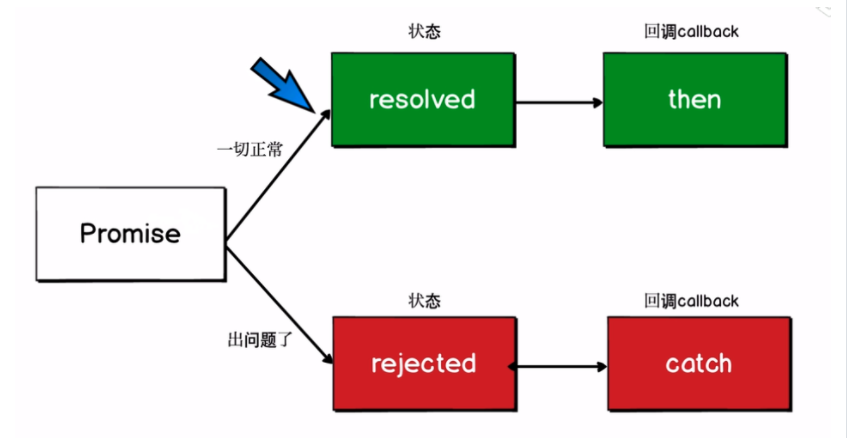

# **Promise的基本使用和原理**

在JavaScript中，所有代码都是单线程执行的。`Promise是异步编程的一种解决方案，比传统的解决方案(回调函数和事件)更合理和更强大。`

```js
const verifyUser = function(username, password, callback) {
  dataBase.verifyUser(username, password, (error, userInfo) => {
    if (error) {
      callback(error);
    } else {
      dataBase.getRoles(username, (error, roles) => {
        if (error) {
          callback(error);
        } else {
          callback(null, userInfo, roles)
        }
      })
    }
  })
}
```

ES6中的promise很好解决了`地狱回调`问题，`地狱回调指的是当太多的异步步骤需要一步一步执行，或者一个函数里有太多的异步操作，这时候就会产生大量嵌套的回调，使代码嵌套太深而难以阅读和维护。`

## Promise原理

一旦状态改变，就不会再变，任何时候都可以得到这个结果。

Promise对象的状态改变只有两种可能：

- 从pending变为fulfilled
- 从pending变为rejected

promise对象初始化状态为pending，当调用resolve，会由pending变为fulfilled；当调用reject，会由pending变为rejected，具体流程：



## Promise使用流程

1. new Promise一个实例，而且要return
2. new Promise时要传入函数，函数有resolve reject两个参数
3. 成功时执行resolve，失败时执行reject
4. then监听结果

```js
function loadImg(src) {
  const promise = new Promise(function(resolve, reject) {
    var img = document.createElement('img');
    img.onload = function() {
      resolve(img);
    }
    img.onerror = function() {
      reject();
    }
    img.src = src;
  })
  return promise; // 返回一个promise实例
}
var src = "http://www.imooc.com/static/img/index/logo_new.png";
var result = loadImg(src);
result.then(function(img) {
  console.log(img.width); // resolved(成功)时候的回调函数
}, function() {
  console.log("failed"); // rejected(失败)时候的回调函数
})
result.then(function(img) {
  console.log(img.height)
})
```

