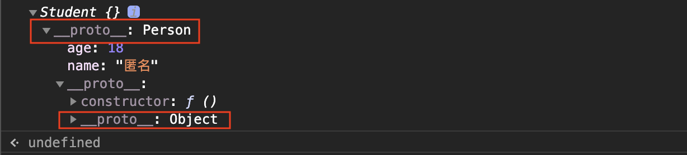

# **原型链与继承**

## 原型和原型链

`原型`：在JavaScript中原型是一个prototype对象，用于表示类型之间的关系

`原型链`：对象之间的继承关系，在JavaScript中是通过prototype对象指向父类对象，直到指向Object对象为止，这样就形成了一个原型指向的链条，专业术语称之为原型链

```js
var Person = function() {
  this.age = 18
  this.name = '匿名'
}
var Student = function() {}
// 创建继承关系，父类实例作为子类原型
Student.prototype = new Person()
var s1 = new Student()
console.log(s1)
```

原型关系图：



当试图得到一个对象的某个属性时，如果这个对象本身没有这个属性，那么会去它的`_proto_`(即它的构造函数的prototype)中寻找。如果一直找到最上层都没有找到，那么就宣告失败，返回`undefined`。最上层是`Object.prototype._proto_ === null`

## prototype和`_proto_`区别

- 所有对象都有`_proto_`属性
- 只有函数对象才有prototype属性
- prototype对象默认有两个属性：constructor和proto
- 实例对象的`_proto_`指向的是函数的prototype
- 函数对象的prototype属性是外部共享的，而`_proto`是隐式的
- 函数和Object的`_proto_`的顶端是`null`

## 继承

几种常见继承方式

- 原型链+借用构造函数的组合继承

```js
function Parent(value) {
  this.val = value
}
Parent.prototype.getValue = function() {
  console.log(this.val)
}
function Child(value) {
  Parent.call(this, value)
}
Child.prototype = new Parent();
const child = new Child();
child.getValue(); // 1
child instanceof Parent // true
```

以上继承方式的核心是`在子类的构造函数中通过Parent.call(this)继承父类的属性，然后改变子类的原型为new Parent()来继承父类的函数`

这种继承方式的优点是**构造函数可以传参，不会与父类引用属性共享，可以复用父类的函数**；缺点是**在继承父类函数的时候调用了父类构造函数，导致子类的原型上多了不需要的父类属性，存在内存上的浪费**

- 寄生组合继承

```js
function Parent(value) {
  this.val = value
}
Parent.prototype.getValue = function() {
  console.log(this.val)
}
function Child(value) {
  Parent.call(this, value)
}
Child.prototype = Object.create(Parent.prototype, {
  constructor: {
    value: Child,
    enumerable: false,
    writable: true,
    configurable: true
  }
})
const child = new Child(1);
child.getValue(); // 1
child instanceof Parent // true
```

以上继承实现的核心就是`将父类的原型赋值给子类，并且将构造函数设置为子类`。这样既解决了无用的父类属性问题，还能正确的找到子类的构造函数

- ES6中的class继承

ES6中引入了`class`关键字，class可以通过`extends`关键字实现继承，还可以通过`static`关键字定义类的静态方法。需要注意 ⚠️ 的是**class关键字只是原型的语法糖，JavaScript继承仍然是基于原型实现的**

```js
class Parent {
  constructor(value) {
    this.val = value
  }
  getValue() {
    console.log(this.val)
  }
}
class Child extends Parent {
  constructor(value) {
    super(value); // 可以看成 Parent.call(this, value)
    this.val = value
  }
}
let child = new Child(1);
child.getValue(); // 1
child instanceof Parent // true
```

class实现继承的核心在于`使用extends表明继承自哪个父类，并且在子类构造函数中必须调用super，因为这段代码可以看成Parent.call(this, value)`