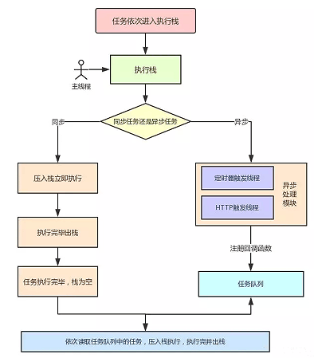

# **异步**

## 同步 VS 异步

`同步`：是一种线性执行的方式，执行的流程不能跨越。

```js
console.log(100)
alert(200)
console.log(300)
// 100 200 300
```


`异步`：是一种并行处理的方式，不必等待一个程序执行完，可以执行其他的任务。

```js
console.log(100)
setTimeout(function() {
  console.log(200)
})
console.log(300)
// 100 300 200
```


## 异步 && 单线程

JS需要异步的根本原因是：`JS是单线程运行的`，即在同一时间只能做一件事，不能一心二用。

为了利用多核CPU的计算能力，HTML5提出Web Worker标准，允许JavaScript脚本创建多个线程，但是子线程完全受主线程控制，且不得操作DOM。所以这个新标准并没有改变JavaScript单线程的本质。

## 前端异步场景

前端使用异步的场景：

- 定时任务：setTimeout、setInterval
- 网络请求：ajax请求、动态加载
- 事件绑定

## Event Loop

##### 名词

- Event Loop：事件循环
- Micro Task：微任务
- Macro Task：宏任务

一个完整的Event Loop过程：



- 一开始执行栈空，我们可以把`执行栈认为是一个存储函数调用的栈结构，遵循先进后出(FILO)的原则`。micro队列空，macro队列里有且只有一个script脚本
- 全局上下文被推入执行栈，同步代码执行。在执行的过程中，会判断是同步任务还是异步任务，通过对一些接口的调用，可以产生新的macro task与micro task，它们会分别被推入各自的任务队列里。同步代码执行完了，script脚本会被移出macro队列，`这个过程本质上是队列的macro task的执行和出队的过程`
- 上一步出队的是一个macro task，这一步处理的是micro task。`当macro task出队时，任务是一个一个执行的，而micro task出队时，任务是一队一队执行的。`因此，我们处理micro队列这一步，会逐个执行队列中的任务并把它出队，直到队列被清空
- `执行渲染操作，更新界面`
- 检查是否存在Web Worker任务，如果有，则对其进行处理
- 循环上述过程，直到两个队列都清空

### 举例

```js
Promise.resolve().then(() => {
  console.log('Promise1')
  setTimeout(() => {
    console.log('setTimeout2')
  },0)
})
setTimeout(() => {
  console.log('setTimeout1')
  Promise.resolve().then(() => {
    console.log('Promise2')
  })
}, 0)

// Promise1 setTimeout1 Promise2 setTimeout2
```

##### 解析

- 一开始执行栈的同步任务(宏任务)，执行完毕会去查看是否有微任务队列，然后执行微任务队列中的所有任务，输出Promise1，同时生成一个宏任务setTimeout2
- 然后去查看宏任务队列，宏任务setTimeout1在setTimeout2之前，先执行宏任务setTimeout1，输出setTimeout1
- 在执行宏任务setTimeout1时会生成微任务Promise2，放入微队列中，接着先去清空微任务队列中的所有任务，输出Promise2
- 清空完微任务队列中的所有任务后，就又会去宏任务队列执行setTimeout2，输出setTimeout2