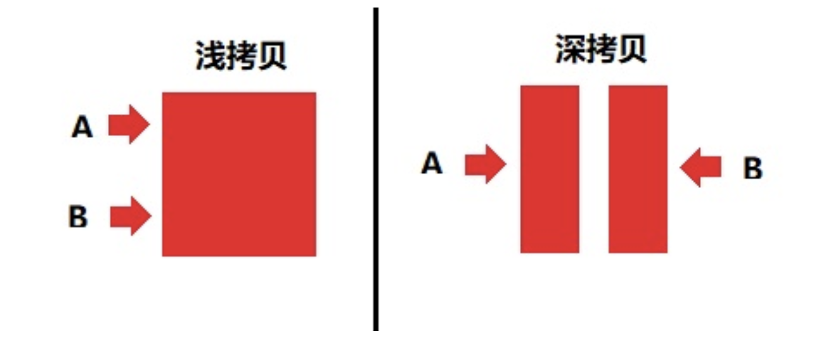

# **深拷贝和浅拷贝**



### 追溯

#### ECAMScript数据类型

- 基本数据类型：Undefined、Null、String、Number、Boolean、Symbol
- 引用数据类型数据：Object、Array、Function、Date...

#### 堆（stack）和栈（heap）

##### 什么是堆和栈？

- `堆(stack)`：栈是一种特殊的列表，栈内的元素只能通过列表的一端访问，这一端称为栈顶。 栈被称为是一种后入先出（LIFO，last-in-first-out）的数据结构。（为动态分配的内存空间，它大小不一定，也不会自动释放）
- `栈(heap)`：堆是一种经过排序的树形数据结构，每个结点都有一个值。 通常我们所说的堆的数据结构，是指二叉堆。（为自动分配的内存空间，它由系统自动释放）

##### 为什么会有堆内存和栈内存的设计

与垃圾回收机制有关，为了使得程序运行时占用的内存最小；

- 栈内存：基本数据类型存储以及回收机制
  - 当一个方法执行时，每个方法都会建立自己的内存栈，在这个方法中定义的变量，将会被依次放入栈内存中。随着该方法的执行结束，这个方法的内存栈也会被自动销毁。这就是我们通常所说的`基本数据类型变量`，通常都放在栈内存中。
- 堆内存：引用数据类型存储以及回收机制
  - 当我们在程序中创建一个对象时，这个对象被保存在运行时数据区，以便反复利用，这个运行时数据区就是堆内存。堆内存中的对象不会随着方法的结束而销毁。即使该方法执行结束，这个对象还可能被另一个引用变量所引用。比如将一个对象作为参数传递时，此时这个对象依然不会被销毁，只有当一个对象，在没有任何变量引用它时，垃圾回收机制才会在合适的时候进行内存回收，这就是我们通常所说的`引用数据类型变量`，通常都放在堆内存中。

#### 什么是深拷贝和浅拷贝

深拷贝和浅拷贝的区别就是`其在内存中的存储类型不同。`


`深拷贝`：将B对象拷贝到A对象中，包括B里面的子对象

`浅拷贝`：将B对象拷贝到A对象中，但不包括B里面的对象。

### 模拟实现浅拷贝

```js
arr.slice();
arr.concat();
```


#### 模拟实现深拷贝

简单办法实现:

```js
JSON.parse(JSON.stringify(obj))
```

手动实现：

```js
const mapTag = '[object Map]';
const setTag = '[object Set]';
const arrayTag = '[object Array]';
const objectTag = '[object Object]';
const argsTag = '[object Arguments]';

const boolTag = '[object Boolean]';
const dateTag = '[object Date]';
const numberTag = '[object Number]';
const stringTag = '[object String]';
const symbolTag = '[object Symbol]';
const errorTag = '[object Error]';
const regexpTag = '[object RegExp]';
const funcTag = '[object Function]';

const deepTag = [mapTag, setTag, arrayTag, objectTag, argsTag];

function forEach(array, iteratee) {
  let index = -1;
  const length = array.length;
  while(++index < length) {
    iteratee(array[index], index);
  }
  return array;
}

function isObject(target) {
  const type = typeof target;
  return target !== null && (type === 'object' || type === 'function');
}

function getType(target) {
  return Object.prototype.toString.call(target);
}

function getInit(target) {
  const Ctor = target.constructor;
  return new Ctor();
}

function cloneSymbol(target) {
  return Object(Symbol.prototype.valueOf.call(target))
}

function cloneReg(target) {
  const reFlags = /\w*$/;
  const result = new target.constructor(traget.source, reFlags.exec(target))
  result.lastIndex = target.lastIndex;
  return result;
}

function cloneFunction(func) {
  const bodyReg = /(?<={)(.|\n)+(?=})/m;
  const paramReg = /(?<=\().+(?=\)\s{)/;
  const funcString = func.toString();
  if (func.prototype) {
    const param = paramReg.exec(funcString);
    const body = bodyReg.exec(funcString);
    if (body) {
      if (param) {
        const paramArr = param[0].split(',');
        return new Function(...paramArr, body[0]);
      } else {
        return new Function(body[0]);
      }
    } else {
      return null
    }
  } else {
    return eval(funcString)
  }
}

function cloneOtherType(target, type) {
  const Ctor = target.constructor;
  switch (type) {
    case boolTag;
    case numberTag;
    case stringTag;
    case errorTag;
    case dateTag:
      return new Ctor(target);
    case regexpTag:
      return cloneReg(target);
    case symbolTag:
      return cloneSymbol(target);
    case funcTag:
      return cloneFunction(target);
    default:
      return null;
  }
}

function clone(target, map = new WeakMap()) {
  // 克隆原始类型
  if (!isObject(target)) {
    return target;
  }
  
  // 初始化
  const type = getType(target);
  let cloneTarget;
  if (deepTag.includes(type)) {
    cloneTarget = getInit(target, type)
  } else {
    return cloneOtherType(target, type);
  }
  
  // 防止循环引用
  if (map.get(target)) {
    return target;
  }
  map.set(target, cloneTarget);
  
  // 克隆set
  if (type === setTag) {
    target.forEach(value => {
      cloneTarget.add(clone(value));
    });
    return cloneTarget;
  }
  
  // 克隆map
  if (type === mapTag) {
    target.forEach((value, key) => {
      cloneTarget.set(key, clone(value));
    });
    return cloneTarget;
  }
  
  // 克隆对象和数组
  const keys = type === arrayTag ? undefined : Object.keys(target);
  forEach(keys || target, (value, key) => {
    if (keys) {
      key = value;
    }
    cloneTarget[key] = clone(target[key], map);
  });
  
  return cloneTarget;
}
```

