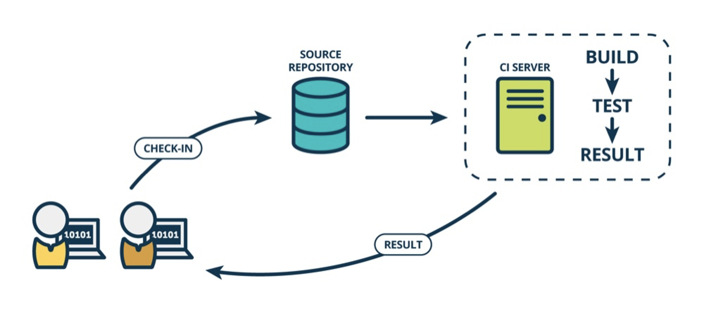
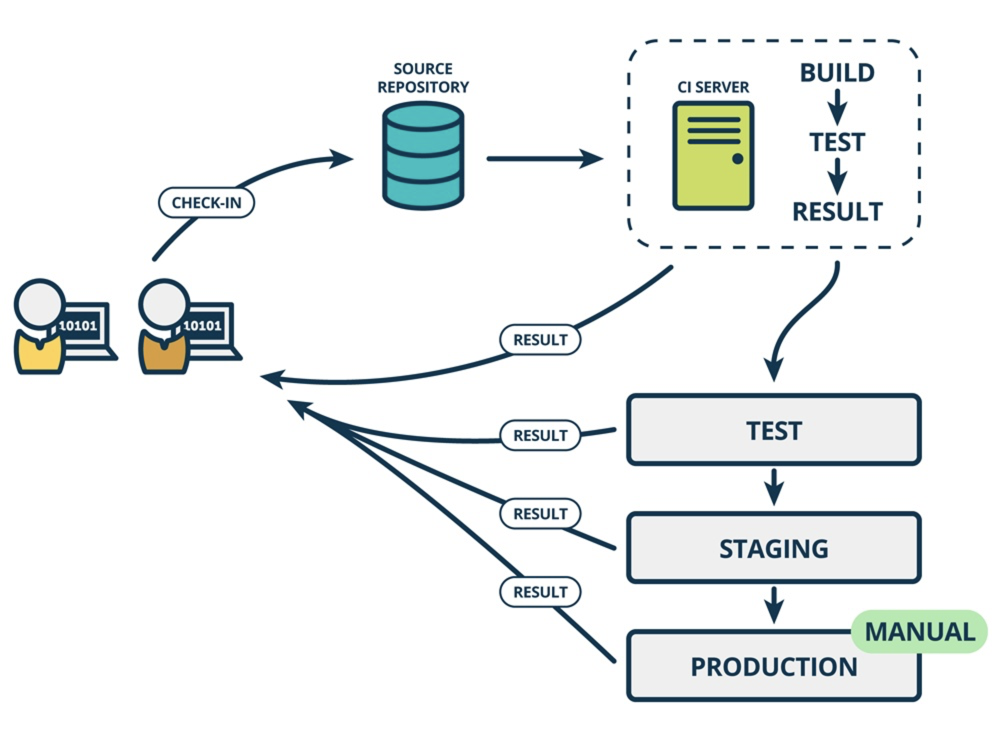
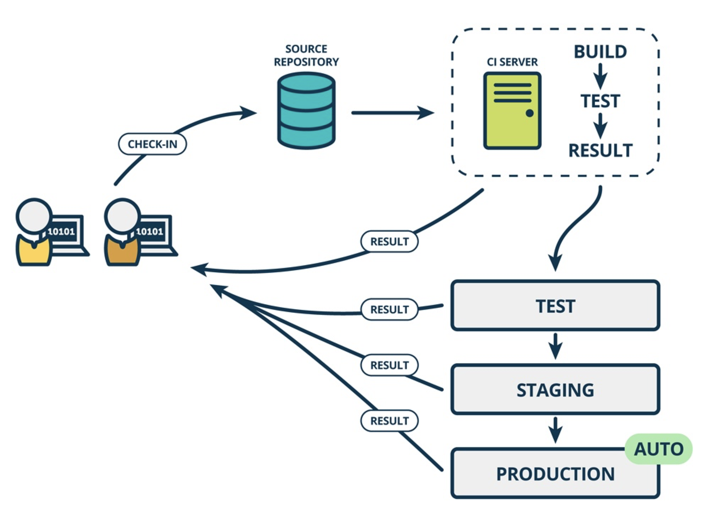

# CI/CD

**持续集成**强调开发人员提交了新代码之后，立刻进行构建、（单元）测试。根据测试结果，我们可以确定新代码和原有代码能否正确地集成在一起

**持续交付**在持续集成的基础上，将集成后的代码部署到更贴近真实运行环境的「类生产环境」（*production-like environments*）中。比如，我们完成单元测试后，可以把代码部署到连接数据库的 Staging 环境中更多的测试。如果代码没有问题，可以继续手动部署到生产环境中。

**持续部署**则是在持续交付的基础上，把部署到生产环境的过程自动化。

