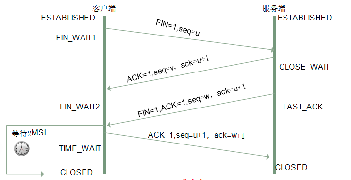

### 三次握手

`三次握手(Three-way Handshake)`，是指建立一个 TCP 连接时，需要客户端和服务器总共发送三个包。进行三次握手的`主要作用就是为了确认双方的接收能力和发送能力是否正常、指定自己的初始化序列号为后面的可靠性传送做准备`。实质上其实就是连接服务器指定端口，建立 TCP 连接，并同步连接双方的序列号和确认号，交换`TCP窗口大小`信息。

- `第一次握手(SYN=1, seq=x)`：客户端给服务端发一个 SYN 报文，并指明客户端的初始化序列号 ISN(c)。此时客户端处于 `SYN_SEND` 状态。

  首部的同步位 SYN=1，初始序号 seq=x，SYN=1 的报文段不能携带数据，但要消耗掉一个序号。

- `第二次握手(SYN=1,ACK=1,seq=y,ack=x+1)`：服务器收到客户端的 SYN 报文之后，会以自己的 SYN 报文作为应答，并且也是指定了自己的初始化序列号 ISN(s)。同时会把客户端的 ISN + 1 作为 ACK 的值，表示自己已经收到了客户端的 SYN，此时服务器处于 `SYN_RCVD` 的状态。

  在确认报文段中 SYN=1，ACK=1，确认号 ack=x+1，初始序号 seq=y。

- `第三次握手(ACK=1,seq=x+1,ack=y+1)`：客户端收到 SYN 报文之后，会发送一个 ACK 报文，当然，也是一样把服务器的 ISN + 1 作为 ACK 的值，表示已经收到了服务端的 SYN 报文，此时客户端处于 `ESTABLISHED` 状态。服务器收到 ACK 报文之后，也处于 `ESTABLISHED` 状态，此时，双方已建立起了连接

  确认报文段 ACK=1，确认号 ack=y+1，序号 seq=x+1（初始为 seq=x，第二个报文段所以要+1），ACK 报文段可以携带数据，不携带数据则不消耗序号。

#### 为什么需要三次握手，两次不行吗？

- 第一次握手：客户端发送网络包，服务器收到了。这样服务器得出结论：客户端的发送能力，服务器的接收能力是正常的。
- 第二次握手：服务器发包，客户端收到了。这样客户端得出结论：服务器的接收、发送能力，客户端的接收、发送能力是正常的。不过此时服务器不能确认客户端的接收能力是否正常。
- 第三次握手：客户端发包，服务器收到了。这样服务端得出结论：客户端的接收、发送能力正常，服务器自己的发送、接收能力也正常。

#### 什么是半连接队列

服务器第一次收到客户端的SYN之后，就会处于SYN_RCVD状态，此时双方还没有完全建立其连接，服务器会把这种状态下请求连接放在一个队列里，我们把这种队列称之为`半连接队列`

完成三次握手，建立起连接的就会放在`全连接队列`中。

### 四次挥手

TCP连接的拆除需要发送四个包，因此成为四次挥手(Four-way handshake)

建立一个连接需要三次握手，而终止一个连接要经过四次挥手。这是由TCP的`半关闭(half-close)`造成的。所谓的半关闭，其实就是TCP提供了连接的一端在结束它的发送后还能接收来自另一端数据的能力。

刚开始双方都处于ESTABLISHED状态，假如是客户端先发起关闭请求。四次挥手过程如下：

- `第一次挥手`：客户端发送一个 FIN 报文，报文中会指定一个序列号。此时客户端处于 `FIN_WAIT1` 状态。 即发出**连接释放报文段**（FIN=1，序号seq=u），并停止再发送数据，主动关闭TCP连接，进入FIN_WAIT1（终止等待1）状态，等待服务端的确认。
- `第二次挥手`：服务端收到 FIN 之后，会发送 ACK 报文，且把客户端的序列号值 +1 作为 ACK 报文的序列号值，表明已经收到客户端的报文了，此时服务端处于 `CLOSE_WAIT` 状态。 即服务端收到连接释放报文段后即发出**确认报文段**（ACK=1，确认号ack=u+1，序号seq=v），服务端进入CLOSE_WAIT（关闭等待）状态，此时的TCP处于半关闭状态，客户端到服务端的连接释放。客户端收到服务端的确认后，进入FIN_WAIT2（终止等待2）状态，等待服务端发出的连接释放报文段。
- `第三次挥手`：如果服务端也想断开连接了，和客户端的第一次挥手一样，发给 FIN 报文，且指定一个序列号。此时服务端处于 `LAST_ACK` 的状态。 即服务端没有要向客户端发出的数据，服务端发出**连接释放报文段**（FIN=1，ACK=1，序号seq=w，确认号ack=u+1），服务端进入LAST_ACK（最后确认）状态，等待客户端的确认。
- `第四次挥手`：客户端收到 FIN 之后，一样发送一个 ACK 报文作为应答，且把服务端的序列号值 +1 作为自己 ACK 报文的序列号值，此时客户端处于 `TIME_WAIT` 状态。需要过一阵子以确保服务端收到自己的 ACK 报文之后才会进入 CLOSED 状态，服务端收到 ACK 报文之后，就处于关闭连接了，处于 `CLOSED` 状态。 即客户端收到服务端的连接释放报文段后，对此发出**确认报文段**（ACK=1，seq=u+1，ack=w+1），客户端进入TIME_WAIT（时间等待）状态。此时TCP未释放掉，需要经过时间等待计时器设置的时间2MSL后，客户端才进入CLOSED状态。

#### 挥手为什么需要四次？

因为当服务端收到客户端的SYN连接请求报文后，可以直接发送SYN+ACK报文。其中**ACK报文是用来应答的，SYN报文是用来同步的**。但是关闭连接时，当服务端收到FIN报文时，很可能并不会立即关闭SOCKET，所以只能先回复一个ACK报文，告诉客户端，"你发的FIN报文我收到了"。只有等到我服务端所有的报文都发送完了，我才能发送FIN报文，因此不能一起发送。故需要四次挥手。

#### 四次挥手释放连接时，等待2MSL的意义是什么？

>MSL是Maximum Segment Lifetime的英文缩写，可译为“最长报文段寿命”，它是任何报文在网络上存在的最长时间，超过这个时间报文将被丢弃。

- 保证客户端发送的最后一个ACK报文段能够到达服务端。 这个ACK报文段有可能丢失，使得处于LAST-ACK状态的B收不到对已发送的FIN+ACK报文段的确认，服务端超时重传FIN+ACK报文段，而客户端能在2MSL时间内收到这个重传的FIN+ACK报文段，接着客户端重传一次确认，重新启动2MSL计时器，最后客户端和服务端都进入到CLOSED状态，若客户端在TIME-WAIT状态不等待一段时间，而是发送完ACK报文段后立即释放连接，则无法收到服务端重传的FIN+ACK报文段，所以不会再发送一次确认报文段，则服务端无法正常进入到CLOSED状态。
- 防止“已失效的连接请求报文段”出现在本连接中。 客户端在发送完最后一个ACK报文段后，再经过2MSL，就可以使本连接持续的时间内所产生的所有报文段都从网络中消失，使下一个新的连接中不会出现这种旧的连接请求报文段。