# 常见前端架构风格及案例

## 分层风格

>Any problem in computer science can be solved by anther layer of indirection.

分层架构是最常见的软件架构，你不知道用什么架构，或者不知道怎么解决问题，那就尝试加多一层。

一个分层系统是按照层次来组织的，每一层为在其之上的层提供服务，并且使用在其之下的层所提供的服务。

**分层通常可以解决什么问题？**

- `隔离业务复杂度与技术复杂度的利器`。典型的例子是网络协议，越高层越面向人类，越底层越面向机器。一层一层网上，很多技术的细节都被隐藏了，比如我们使用`HTTP`时，不需要考虑`TCP`层的握手和包传输细节，`TCP`层不需要关心`IP`层的寻址和路由。
- `分离关注点和复用`。减少跨越多层的耦合，当一层变动时不会影响到其他层。例如我们前端项目建议拆分逻辑层和视图层，一方面可以降低逻辑和视图之间的耦合，当视图层元素变动时可以尽量减少对逻辑层的影响；另一个好处是，当逻辑抽取出去后，可以被不同平台的视图复用。

**一些分层案例**：

### Virtual DOM

前端石器时代，我们页面交互和渲染，是通过服务端渲染或者直接操作 DOM 实现的，有点像 C/C++ 这类系统编程语言手动操纵内存。后来随着软硬件性能越来越好、Web 应用也越来越复杂，前端开发者的生产力也要跟上，类似 JQuery 这种命令式的编程方式无疑是比较低效的。尽管手动操作 DOM 可能可以达到更高的性能和灵活性，但是这样对大部分开发者来说太低效了，我们是可以接受牺牲一点性能换取更高的开发效率的。

**怎么解决？再加一层吧**。后来 React 就搞了一层 `Virtual DOM`，我们可以声明式、组合式地构建一棵对象树，然后交由 React 将它映射到 DOM：

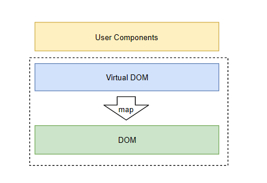

一开始 Virtual DOM 和 DOM 的关系是耦合在一起的。后来进行了更彻底的分层，有着这个抽象层我们可以将 Virtual DOM 映射到更多类似应用场景：

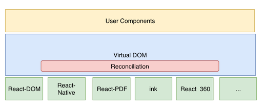

`Virtual DOM 更大的意义在于开发方式的转变：声明式、数据驱动，让开发者不需要关心 DOM 的操作细节(属性操作、事件绑定、DOM 节点变更)，换句话说，应用的开发方式变成了 view = f(state)，这对生产力的解放是有很大推动作用的`；另外有了 Virtual DOM 这一抽象层，使得多平台渲染成为可能。

### Taro

**[Taro](https://taro-docs.jd.com/taro/docs/README) 和 React 一样也采用分层架构风格，只不过他们解决的问题是相反的。React 加上一个分层，可以渲染到不同的视图形态；而 Taro 则是为了统一多样的视图形态**。如今市面上端的形态多种多样， Web、React-Native、微信小程序...针对不同的端去编写多套代码的成本非常高，这种需求催生了 Taro 这类框架的诞生。**使用 Taro 我们可以只书写一套代码，通过编译工具可以输出到不同的端**。

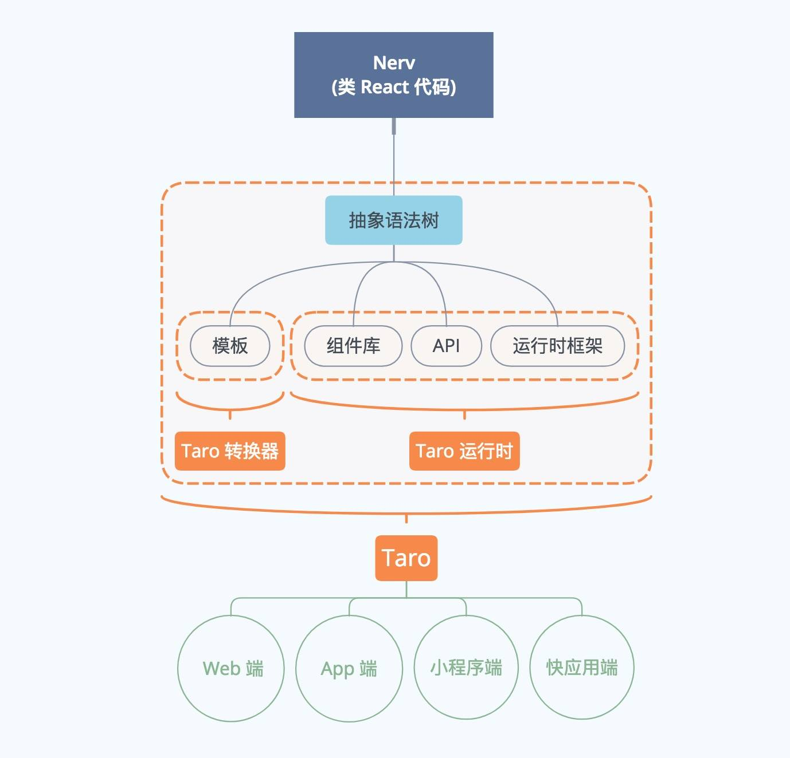

## 管道和过滤器

`在管道/过滤器架构风格中，每个组件都有一组输入和输出，每个组件职责都很单一，数据输入组件，经过内部处理，然后将处理过的数据输出。所以这些组件也被称为过滤器`。连接器按照业务需求将组件连接起来，其形状就像管道一样，这种架构风格由此得名。

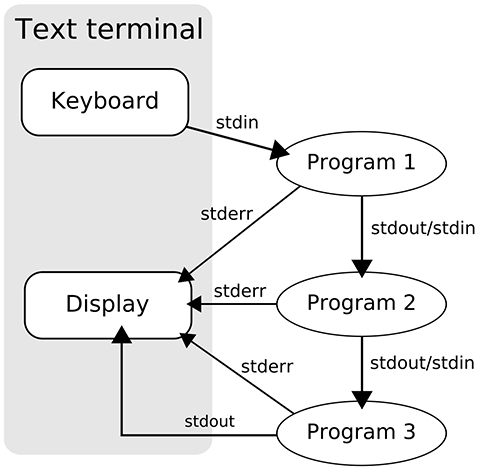

最经典的案例是 `Unix` shell 命令，Unix 的哲学就是“只做一件事，把它做好”，Unix Shell 有一法宝就是`管道`，通过管道我们可以将命令通过 `标准输入输出`串联起来实现复杂的功能。

```shell
# 获取网页，并进行拼写检查。代码来源于wiki
curl "http://en.wikipedia.org/wiki/Pipeline_(Unix)" | \
sed 's/[^a-zA-Z ]/ /g' | \
tr 'A-Z ' 'a-z\n' | \
grep '[a-z]' | \
sort -u | \
comm -23 - /usr/share/dict/words | \
less
```

管道模式在前端领域也有很多应用，主要集中在前端工程化领域。例如老牌的项目构建工具 [Gulp](https://www.gulpjs.com.cn/)，Gulp 使用管道化模式来处理各种文件类型，管道中的每一步骤称为 Transpiler(转译器)，它们以 NodeJS 的Stream 作为输入输出。整个过程高效而简单。

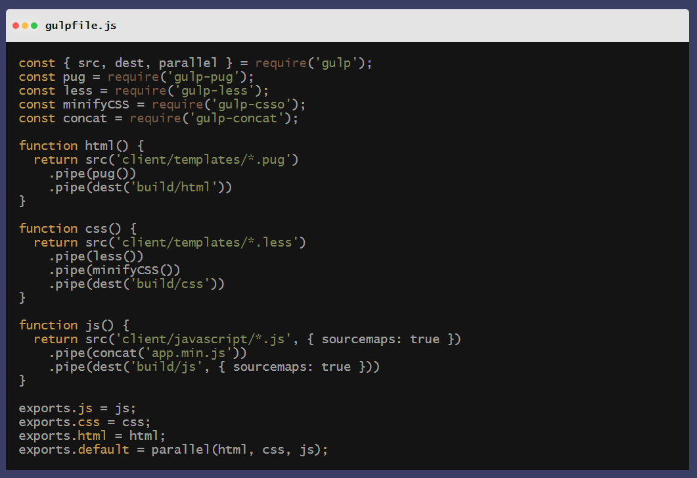

[Webpack](https://www.webpackjs.com/) 打包工具也使用同样的模式来实现对文件的处理，即 [Loader](https://www.webpackjs.com/concepts/loaders/)，Loader 用于对模块的源代码进行转换，通过 Loader 的组合，可以实现复杂的文件转译需求。

```js
// webpack.config.js
module.exports = {
  ...
  module: {
    rules: [{
      test: /\.scss$/,
      use: [{
          loader: "style-loader" // 将 JS 字符串生成为 style 节点
      }, {
          loader: "css-loader" // 将 CSS 转化成 CommonJS 模块
      }, {
          loader: "sass-loader" // 将 Sass 编译成 CSS
      }]
    }]
  }
};

```

### 中间件(Middleware)

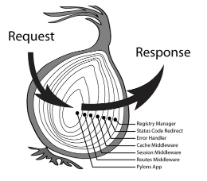

如果开发过 Express、Koa或者 Redux，你可能会发现中间件模式和上述管道模式有一定的相似性，如上图，相比管道，中间件模式可以使用一个洋葱剖面来形容。但和管道相比，一般的中间件实现有以下特点：

- `中间件没有显式的输入输出`。这些中间件之间通常通过集中式的上下文对象来共享状态
- `有一个循环的过程`。管道中，数据处理完毕后交给下游了，后面就不管了。而中间件还有一个回归的过程，当下游处理完毕后会进行回溯，所以有机会干预下游的处理结果。

**将中间件看作一个特殊形式的管道模式**。这种模式通常用于后端，它可以干净地分离出请求的不同阶段，也就是分离关注点。比如我们可以创建这些中间件：

- 日志：记录开始事件、计算响应时间、输出请求日志
- 认证：验证用户是否登录
- 授权：验证用户是否有执行该操作的权限
- 缓存：是否有缓存结果，有的话就直接返回，当下游响应完成后，再判断一下响应是否可以被缓存
- 执行：执行实际的请求处理或响应

有了中间件之后，我们不需要在每个响应处理方法中都包含这些逻辑，关注好自己该做的事情。下面是 Koa 的示例代码：

```js
const Koa = require('koa');
const app = new Koa();

// logger

app.use(async (ctx, next) => {
  await next();
  const rt = ctx.response.get('X-Response-Time');
  console.log(`${ctx.method} ${ctx.url} - ${rt}`);
});

// x-response-time

app.use(async (ctx, next) => {
  const start = Date.now();
  await next();
  const ms = Date.now() - start;
  ctx.set('X-Response-Time', `${ms}ms`);
});

// response

app.use(async ctx => {
  ctx.body = 'Hello World';
});

app.listen(3000);

```


## 事件驱动

事件驱动，或者称为`发布-订阅`风格，对于前端开发来说是再熟悉不过的概念了。**它定义了一种一对多的依赖关系**，在事件驱动系统风格中，`组件不直接调用另一个组件，而是触发或广播一个或多个事件`。系统中的其他组件在一个或多个事件中注册。当一个事件被触发，系统会自动通知在这个事件中注册的所有组件。

这样就**分离了关注点，订阅者依赖于事件而不是依赖于发布者，发布者也不需要关心订阅者，两者解除了耦合**。

生活中也有很多`发布-订阅`的例子，比如微信公众号信息订阅，当新增一个订阅者的时候，发布者并不需要作出任何调整，同样发布者调整的时候也不会影响到订阅者，只要协议没有变化。我们可以发现，**发布者和订阅者之间其实是一种弱化的动态的关联关系**。

**解除耦合目的是一方面，另一方面也可能由基因决定的，一些事情天然就不适合或不支持用同步的方式去调用，或者这些行为是异步触发的**。

JavaScript 的基因决定事件驱动模式在前端领域的广泛使用。JavaScript 是单线程的编程语言，为了应对各种实际的应用场景，一个线程压根儿忙不过来，事件驱动的异步方式是 JavaScript 的救命稻草。

浏览器方面，浏览器就是一个 GUI 程序，**GUI 程序是一个事件循环，接收用户输入，程序处理然后反馈到页面，再接收用户输入...**用户的输入是异步，将用户输入抽象为事件是最简洁、自然、灵活的方式。

>需要注意 ⚠️ 的是：异步 !== 事件驱动，事件驱动 !== 异步

##### 扩展

- **响应式编程**：响应式编程本质上也是事件驱动的，下面是前端领域比较流行的两种响应式模式：
  - `函数响应式(Functional Reactive Programming)`，典型代表 RxJS
  - `透明的函数响应式编程(Transparently applying Functional Reactive Programming - TFRP)`，典型代表 Vue、Mobx
- **消息总线**：指接收、发送消息的软件系统。消息基于一组已知的格式，以便系统无需知道实际接受者就能互相通信

## MV*

`MV*`架构风格应用非常广泛。我觉得的`MV*`本质上也是一种分层架构，一样强调职责分离。其中最为经典的是MVC架构风格，除此之外还有各种衍生风格，例如 `MVP`、`MVVM`、`MVI(Model View Intent)`。还有有点关联的`Flux`或者`Redux`。

### 家喻户晓的 MVC

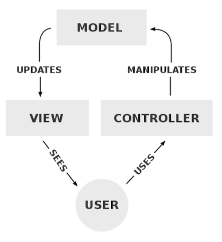

MVC 将应用分为三层，分别是：

- `视图层(View)`：呈现数据给用户
- `控制器(Controller)`：模型和视图之间的纽带，起到不同层的组织作用
  - **处理事件并作出响应**。一般事件由用户的行为(比如用户点击、客户端请求)，模型层的变更
  - **控制程序的流程**。根据请求选择适当的模型进行处理，然后选择适当的视图进行渲染，最后呈现给用户
- `模型(Model)`：封装与应用程序的业务逻辑相关的数据以及对数据的处理方法，通常它需要和数据持久化层进行通信

目前前端应用很少有纯粹使用 MVC 的，要么视图层混合了控制器层，要么就是模型和控制器混合，或者干脆就没有所谓的控制器。**但有一点可以确定的是，很多应用都分离了逻辑层和视图层**。

### Redux

Redux 是 Flux 架构的改进，融合了 Elm 语言中函数式的思想。下面是 Redux 的架构图：

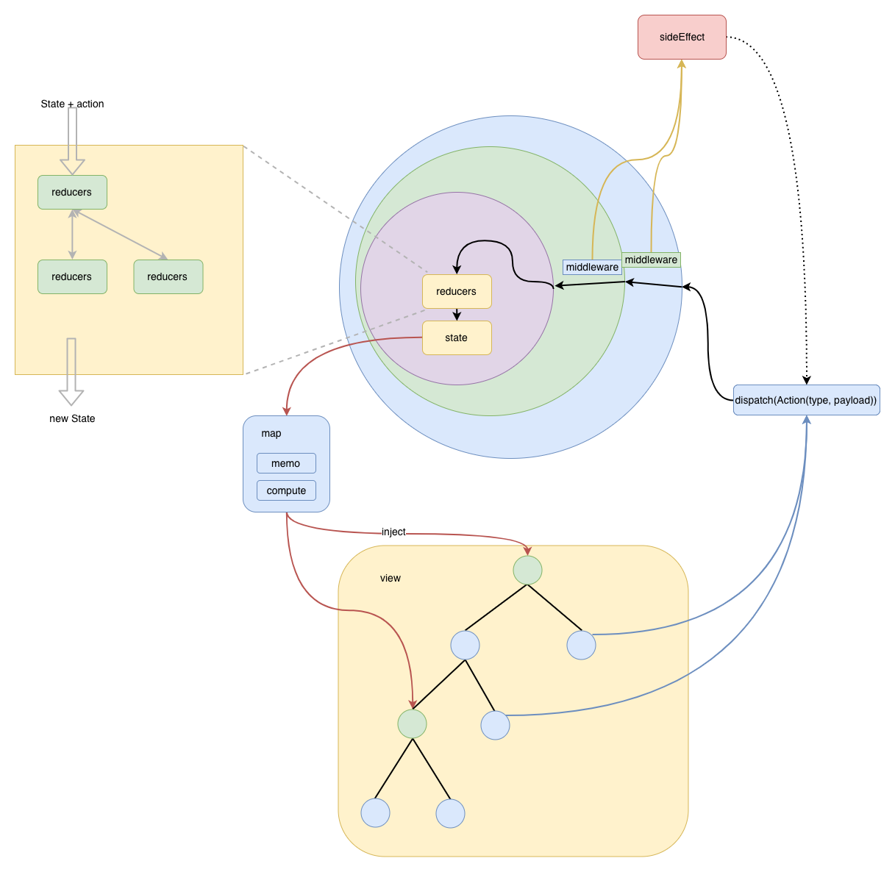

从上图可以看出 Redux 架构有以下要点：

- `单一的数据源`
- `单向的数据流`

单一数据源，首先解决的是**传统 MVC 架构多模型数据流混乱问题**(如下图)。单一的数据源可以**让应用的状态可预测和可被调试**。另外单一数据源也**方便做数据镜像，实现撤销/重做，数据持久化**等等功能。

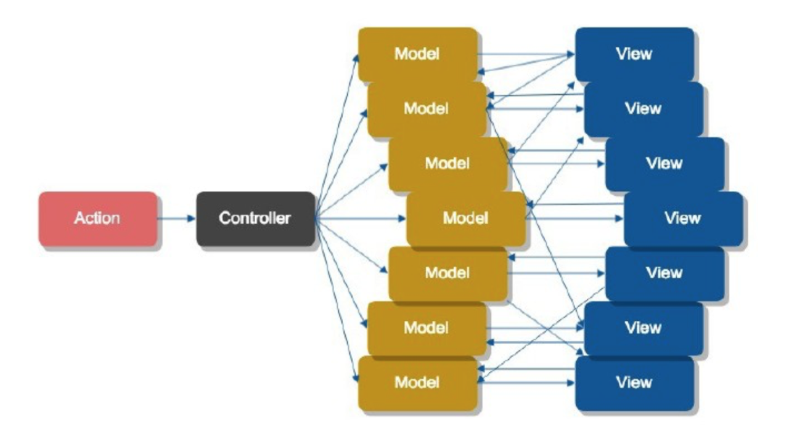

单向数据流用于辅助单一数据源，主要目的是**阻止应用代码直接修改数据源**，这样一方面简化数据流，同样也让应用状态变化变得可预测。

上述两个特点是 Redux 架构风格的核心，至于 Redux 还强调不可变数据、利用中间件封装副作用、范式化状态树，只是一种最佳实践。还有许多`类 Redux`的框架，例如`Vuex`、`ngrx`，在架构思想层次是一致的：

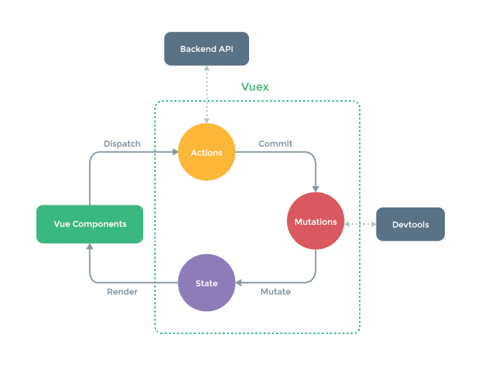

## 微内核架构

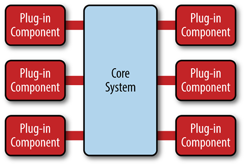

`微内核架构(MicroKernel)又称为“插件架构”，指的是软件的内核相对较小，主要功能逻辑和业务逻辑都通过插件形式实现`。内核只包含系统运行的最小功能。插件之间相互独立，插件之间的通信，应该降到最低，减少相互依赖。

**微内核架构的难点在于建立一套粒度合适的插件协议、以及对插件之间进行适当的隔离和解耦。从而才能保证良好的扩展性、灵活性和可迁移性**。

前端领域比较典型的例子是 `Webpack`、`Babel`、`PostCSS` 以及 `ESLint`，这些应用需要应对复杂的定制需求，而且这些需求时刻在变，只有微内核架构才能保证灵活和可扩展性。

## 微前端

`微前端旨在将单体前端分解成更小、更简单的模块，这些模块可以被独立的团队进行开发、测试和部署，最后再组合成一个大型的整体`。

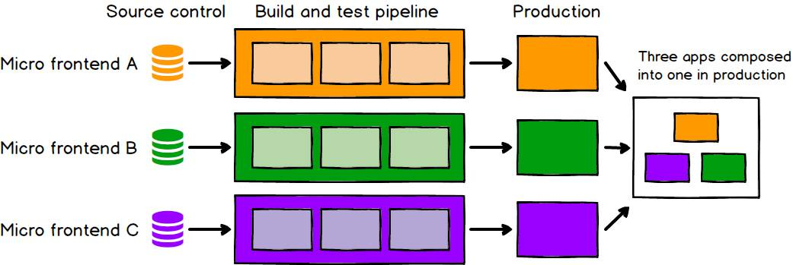

微前端下各个应用模块是独立运行、独立开发、独立部署的，相对应的会配备更加自治的团队。微前端的实施还需要有稳固的前端基础设施和研发体系的支撑。

## 组件化架构

组件化开发对现在的我们来说如此自然，就像水对鱼一样。以致于我们忘了组件化也是一种非常重要的架构思想，`它的中心思想就是分而治之`。按照 Wiki 上面的定义是：`组件化就是基于可复用目的，将一个大的软件系统按照分离关注点的形式，拆分成多个独立的组件，主要目的就是减少耦合`。

按照 Vue 官网的说法：`组件系统是 Vue 的另一个重要概念，因为它是一种抽象，允许我们使用小型、独立和通常可复用的组件构建大型应用。仔细想想，几乎任意类型的应用界面都可以抽象为一个组件树`。

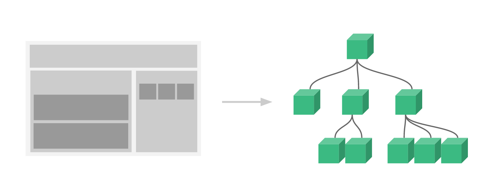

按照个人理解，**组件跟函数是一样的东西，这就是为什么函数式编程思想在 React 中会应用得如此自然**。若干个简单函数，可以复合成复杂的函数，复杂的函数再复合成复杂的应用。对于前端来说，页面也是这么来的，一个复杂的页面就是有不同粒度的组件复合而成的。

组件的另外一个重要的特征就是`内聚性`，它是一个独立的单元，自包含了所有需要的资源。