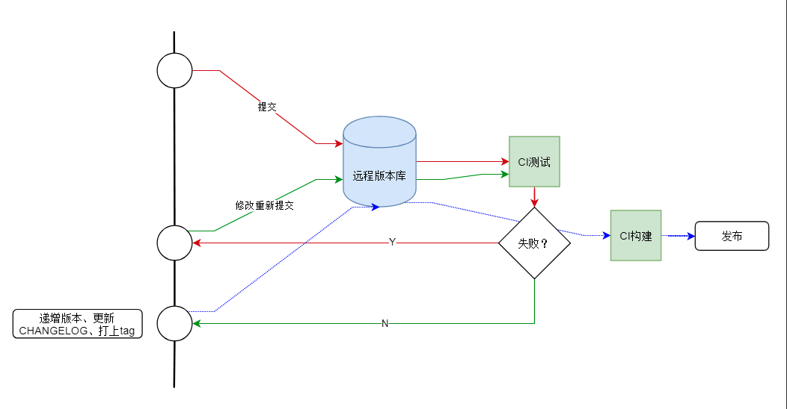
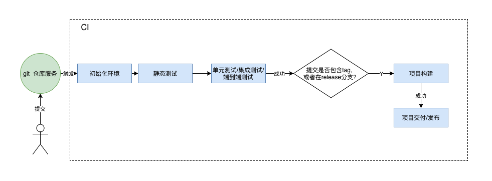
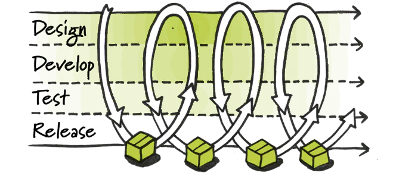
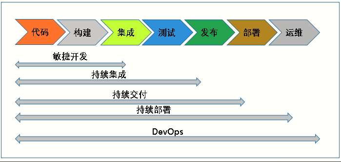
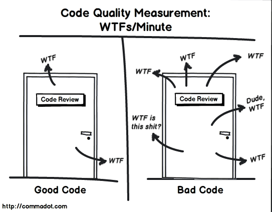
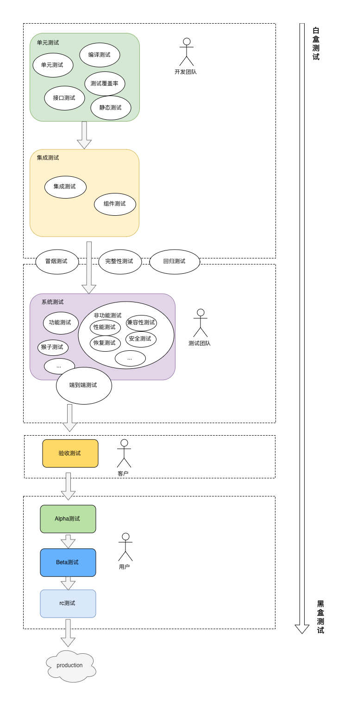
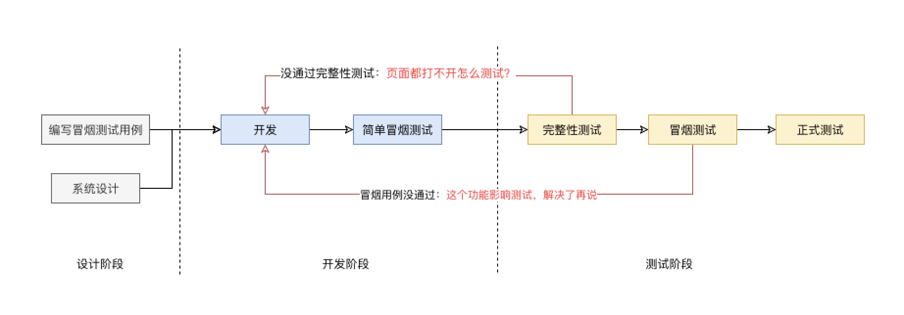
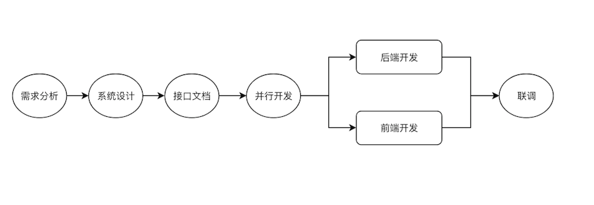
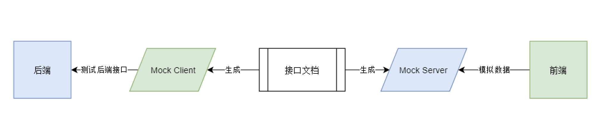

# 怎么制定前端协作规范

## 目录

- [1 工作流规范](#1)

- [2 技术栈规范](#2)

- [3 项目组织规范](#3)

- [4 编码规范](#4)

- [5 文档规范](#5)

- [6 测试规范](#6)

- [7 异常处理、监控和调试规范](#7)

- [8 前后端协作规范](#8)

## 前言

### 什么是规范

`规范`，名词意义即：明文规定或约定俗成的标准，如道德规范、技术规范等。动词意义上是指按照既定标准、规范的要求进行操作，使某一行为或活动达到或超越规定的标准，如规范管理、规范操作。

### 为什么需要规范

- 降低新成员融入团队的成本，同时也一定程度避免挖坑
- 提高开发效率、团队协作效率，降低沟通成本
- 实现高度统一的代码风格，方便 review ，另外一方面可以提高项目的可维护性
- 规范是实现自动化的基础
- 规范是一个团队只是沉淀的直接输出

### 规范包含哪些内容

**前端协作规范并不单单指“编码规范”，这个规范涉及到前端开发活动的方方面面**，例如代码库的管理、前后端协作、代码规范、兼容性规范。

不仅仅是前端团队内部需要协作，一个完整的软件生命周期内，我们需要和产品/设计、后端、测试进行协作，我们需要覆盖这些内容。

<h2 id="1">1. 工作流规范</h2>

### 1.1 开发

#### 1.1.1 版本规范

项目的版本号应该根据某些规则进行迭代，这里推荐使用[语义化版本](https://semver.org/lang/zh-CN/)规范，版本格式：主版本号.次版本号.修订号，版本号规则如下：

- 主版本号：当你做了不兼容的 API 修订
- 次版本号：当你做了向下兼容的功能性新增
- 修订号：当你做了向下兼容的问题修正

#### 1.1.2 版本控制系统规范

比较流行的 git 分支模型/工作流是 [git-flow](https://www.git-tower.com/learn/git/ebook/cn/command-line/advanced-topics/git-flow/)，但是大部分团队会根据自己的情况制定自己的git工作流规范，例如 [分支规范](https://github.com/GDJiaMi/frontend-standards/blob/master/development.md#git-%E5%88%86%E6%94%AF%E6%A8%A1%E5%9E%8B)

#### 1.1.3 提交信息规范

**组织好的提交信息，可以提高项目的整体质量**，至少具有以下优点：

- `格式统一的提交信息有助于自动化生成 CHANGELOG`
- `版本库不只是存放代码的仓库，它记录项目的开发日志，它应该要清晰表达这次提交的做了什么`。这些记录应该可以帮助后来者快速地学习和回顾代码，也应该方便其他协作者 review 你的代码
- `规范化提交信息可以促进提交者提交有意义的、粒度合适的提交`。提交者要想好怎么描述这个提交，这样被动促进了他们去把控提交的粒度

**社区上比较流行的提交信息规范是[Angular 的提交信息规范](https://github.com/angular/angular/blob/master/CONTRIBUTING.md#commit)**

另外，这些工具可以帮助你检验提交信息：

- [conventional-changelog](https://github.com/conventional-changelog/conventional-changelog) - 从项目的提交信息中生成 CHANGELOG 和发布信息
- [commitlint](https://github.com/conventional-changelog/commitlint) - 检验提交信息
- [commitizen](https://github.com/commitizen/cz-cli) - 简单的提交规范和提交帮助工具（**推荐，目前在用**）
- [standard-changelog](https://github.com/conventional-changelog/commitlint) - angular 风格的提交命令行工具

### 1.2 构建规范

对于团队、或者需要维护多个项目场景，统一的构建工具链很重要，**这套工具应该强调`约定大于配置`，让开发者更专注于业务的开发。**

我们可以选择第三方 CLI，也可以定制自己的构建链，这个构建链应该有以下特点：

- `强约定，体现团队的规范`。首先它应该避免团队成员去关心或更改构建的配置细节，暴露最小化的配置接口。另外构建工具不仅仅是构建，通常它还会集成代码检查、测试等功能。
- `方便升级`。尤其是团队需要维护多个项目场景，这一点很有意义。

下面是目前比较流行的构建工具：

- [create-react-app](https://github.com/facebook/create-react-app) - 零配置开始 React 开发(**推荐！目前在用**)
- [vue-cli](https://cli.vuejs.org/) - 零配置、渐进增强的项目构建 CLI

### 1.3 发布工作流规范

`发布工作流`指的是将软件成品对外发布(如测试或生产)的一套流程，将这套流程规范化后，可以实现自动化。

一个典型的发布工作流如下：



- 代码变更
- 提交代码变更到远程版本库
- 程序通过 CI 测试
- 提升 package.json 中的版本
- 生成 CHNAGELOG
- 提交 package.json 和 CHANGELOG.md 文件
- 打 Tag
- 推送

### 1.4 持续集成

将整套开发工作流确定下来后，就可以使用`持续集成服务`来自动化执行整个流程。比如一个典型的 CI 流程。



**持续集成是什么**

我们需要将`持续集成`拆开两个词分别来理解，什么是`持续` ? 什么是`集成`？

**什么是持续**

**`持续(Continuous)`，可以理解为频繁或者连续性**。不管是持续集成还是敏捷开发思维、看板，都认为`持续`是它们的基础。

比如**代码检查，`持续性`的代码检查就是代码一变动(如保存或者IDE实时检查或者提交到版本库时)就马上检查代码，而`非持续性`的代码检查就是在完成所有编码后，再进行检查**。对比两者可以发现，持续性的代码检查可以尽早地发现错误，而且错误也比较容易理解和处理，反之非持续性的代码检查，可能会发现一堆的错误，失之毫厘谬以千里，错误相互牵连，最终会变得难以收拾。

`持续`的概念，可以用于软件开发的方方面面，**本质上就是把传统瀑布式的软件开发流程打碎，形成一个个更小的开发闭环，持续地输出产品，同时产品也持续地给上游反馈和纠正**。



**什么是集成**

**狭义的集成可以简单认为是[集成测试](../测试/集成测试)**，集成测试可以对代码静态测试、单元测试、通过单元测试后可以进行集成测试，在应用组成一个整体后在模拟环境中跑 E2E 测试等。**也就是说，在这里进行一系列的自动化测试来验证软件系统**。

**广义的持续集成服务，不仅仅是测试，还衍生出很多概念，例如持续交付、持续部署**，如图：



**持续集成的好处**:

- 尽早发现错误，快速试错。越早发现错误，处理错误的成本越低
- 自动化工作流，减少人工干预。人类比机器容易犯错，而且机器擅长做重复的事

**持续集成规范一般定义这些内容**：

- 执行的环境。比如容器、Node版本、操作系统等
- 触发的条件。比如定时触发、在哪个分支触发、会触发什么任务等
- 执行的任务
- 划分持续集成的阶段
  - 检查：包括单元测试和代码 lint。所有 push 到版本库的代码都会跑到这个阶段。
  - 构建：对前端项目进行构建，只有打上版本 tag 的提交或者 release 分支在构建成功后会跑构建任务
  - 发布：将前端的构建结果进行交付/发布，只有打上版本 tag 的提交或者 release 分支在构建成功后会跑发布任务
- 定义持续集成脚本模板

**常用的 CI 服务**：

- Github
  - [Travis CI](https://github.com/marketplace/travis-ci)
- GitLab
  - [Gitlab-CI](https://docs.gitlab.com/ee/ci/)
- [Jenkins](https://jenkins.io/)

### 1.5 任务管理

`看板是目前最为流行的任务管理工具，它可以帮助我们了解项目的进度、资源的分配情况、还原开发现场`。

比较好用的工具：

- [Tower](https://tower.im/) - 专门做看板任务管理。
- [Trello](https://trello.com/) - 颜值高
- [Jira](https://www.atlassian.com/software/jira) - 一直在使用，很强大

<h2 id="2">2. 技术栈规范</h2>

**团队的开发效率是基于稳定且熟练的技术栈的**。稳定的技术栈规范有利于团队协作和沟通；另外如果团队精通这个技术栈，当出现问题或者需要深入调优，会相对轻松。

前端技术栈规范主要包含下面这些类型：

- 编程语言 - TypeScript or JavaScript
- UI 框架及其配套生态，以及备选方案。其背后的生态非常庞大：
  - UI 框架
  - 路由
  - 状态管理
  - 组件库
  - 国际化
  - 动画
  - 服务端渲染
  - 脚手架、CLI 工具
  - 组件测试
- 样式 - 包含了命名规范、预处理器、方法论等
- 动画引擎
- QA - 包含了测试、Lint、格式化工具、监控
- 项目构建工具 - 例如 webpack、vue-cli、create-react-app
- 包管理器 - npm、yarn
- 项目管理工具 - jira
- 时间处理 - Moment.js
- 模板引擎
- 开发工具 - VSCode
- 后端开发框架
- 工具库
- 开发/调试工具
- 版本管理 - git
- 持续集成 - Jenkins

**参考**

- [技术栈规范](https://github.com/GDJiaMi/frontend-standards/blob/master/tech-stack.md)

### 2.1 技术选型

- 选择你最熟悉的技术
- 选择拥有强大生态和社区的开源技术
- 选择成长期的技术
- API 的稳定性
- 基础设施配合
- 业务考虑

### 2.2 迎接新技术

当团队容纳一个新的技术选型需要考虑以下几点：

- `学习成本`。考虑团队成员的接纳能力，如果成本小于收获的收益，在团队里面推行估计阻力会比较小
- `收益`。是否能够解决当前的某些痛点
- `考虑风险`。一般我们不能将一个实验阶段的技术使用于生产环境中

<h2 id="3">3. 项目组织规范</h2>

项目组织规范定义了如何组织一个前端项目，例如项目的命名、项目的文件结构、版本号规范等。尤其对于开源项目，规范化的项目组织就更重要了。

### 3.1 通用的项目组织规范

一个典型的项目组织规范如下：

- `README.md`：项目说明，这个最重要。你必须在这里提供关于项目的关键信息或者相关信息的入口。一般包含以下信息：

  - 简要描述、项目主要特性
  - 运行环境/依赖、安装和构建、测试指南
  - 简单示例代码
  - 文档或文档入口，其他版本或相关资源入口
  - 联系方式、讨论群
  - 许可、贡献/开发指南

- `CHANGELOG.md`：放置每个版本的变动内容，通常要描述每个版本变更的内容。方便使用者确定应该使用哪个版本。

- `package.json`：前端项目必须。描述当前的版本、可用命令、包名、依赖、环境约束、项目配置等信息

- `.gitignore`：忽略不必要的文件，避免将自动生成的文件提交到版本库

- `.gitattributes`：git 配置，有一些跨平台差异的行为可能需要在这里配置一下，如换行规则

- `docs/`：项目的细化文档，可选

- `examples/`：项目的示例代码，可选

- `build`：项目工具类脚本放置在这里，非必须。如果使用统一构建工具，则没有这个目录

- `dist/`：项目构建结果输出目录

- `src/`：源代码目录

- `tests/`：单元测试目录，按照[Jest](https://jestjs.io/)规范，`_tests_`目录通常和被测试的模块在同一父目录下

- `tests`：全局测试目录，通常放应用的集成测试或 E2E 测试等用例

- `.env*`：项目中我们通常会使用`环境变量`来影响应用在不同环境下的行为。通常有三个文件：

  - `.env`：通用的环境变量
  - `.env.development`：开发环境的环境变量
  - `.env.production`：生成环境的环境变量

  基本上这些文件的变动频率很少，团队成员应该不要随意变动，以免影响其他成员。所以通常会使用`.env.*.local`文件来覆盖上述的配置，另外会设置版本库来忽略`*.local`文件


**对于开源项目通常还包括这些目录**:

- `LICENSE`：说明项目许可
- `.github`：开源贡献规范和指南
  - CONTRIBUTING：贡献指南，一般会说明贡献的规范、以及项目的基本组织、架构等信息
  - CODE_OF_CONDUCT：行为准则
  - COMMIT_CONVENTION：提交信息规范
  - ISSUE_TEMPLATE：Issue 的模板
  - PULL_REQUEST_TEMPLATE： PR 模板

### 3.2 目录组织的风格

**项目组织主要有三种风格**：

- Rails-style：按照文件的类型划分为不同的目录，例如 `componnets`、`constants`、`typings`、`views`，这个来源于Ruby-on-Rails 框架，它按照 MVC 架构来划分不同的目录类型，典型的目录结构：

```shell
  app
    models # 模型
    views # 视图
    controllers # 控制器
    helpers # 帮助程序
    assets  # 静态资源
  config     # 配置
    application.rb
    database.yml
    routes.rb      # 路由控制
    locales        # 国际化配置
    environments/
  db        # 数据库相关

```

- Domain-style：按照一个功能特性或业务创建单独的目录，这个目录就近包含多种类型的文件或目录。比如一个典型的 Redux 项目，所有项目的文件就近防止在同一个目录下：

```shell
Users/
Home/
  components/
  actions.js
  actionTypes.js
  constants.js
  index.js
  model.js
  reducer.js
  selectors.js
  style.css
index.js
rootReducer.js

```

- Ducks-style：优点类似于 Domain-style，不过更彻底，通常将相关联的元素定义在同一文件下。Vue 的单文件组件就是一个典型的例子，除此之外 Vuex 也是使用这种风格：

```js
<template>
  <div id="app">
    <h1>My Todo App!</h1>
    <TodoList/>
  </div>
</template>

<script>
import TodoList from './components/TodoList.vue'

export default {
  components: {
    TodoList
  }
}
</script>

<style lang="scss">
@import './variables.scss';
/* ... */
</style>

```

大部分情况下，我们都是使用混合两种方式的目录结构，例如：

```shell
src/
  components/      # 🔴 项目通用的‘展示组件’
    Button/
      index.tsx    # 组件的入口, 导出组件
      Groups.tsx   # 子组件
      loading.svg  # 静态资源
      style.css    # 组件样式
    ...
    index.ts       # 到处所有组件
  containers/      # 🔴 包含'容器组件'和'页面组件'
    LoginPage/     # 页面组件, 例如登录
      components/  # 页面级别展示组件，这些组件不能复用与其他页面组件。
        Button.tsx # 组件未必是一个目录形式，对于一个简单组件可以是一个单文件形式. 但还是推荐使用目录，方便扩展
        Panel.tsx
      reducer.ts   # redux reduces
      useLogin.ts  # (可选)放置'逻辑', 按照👆分离逻辑和视图的原则，将逻辑、状态处理抽取到hook文件
      types.ts     # typescript 类型声明
      style.css
      logo.png
      message.ts
      constants.ts
      index.tsx
    HomePage/
    ...
    index.tsx      # 🔴应用根组件
  hooks/           # 🔴可复用的hook
    useList.ts
    usePromise.ts
  ...
  index.tsx        # 应用入口, 在这里使用ReactDOM对跟组件进行渲染
  stores.ts        # redux stores
  contants.ts      # 全局常量

```


### 3.3 脚手架和项目模板

在将项目结构规范确定下来后，可以创建自己的脚手架工具或项目模板，用于快速初始化一个项目或代码模板。

相关资源：

- [create-react-app](https://github.com/facebook/create-react-app) - 创建新的 React 应用
- [generact](https://github.com/diegohaz/generact) - 生成 React 组件，大部分组件的文件结构差不多，这个工具就是帮助你生成这些重复的代码

<h2 id="4">4. 编码规范</h2>

**统一的编码规范对团队项目的长远维护很有用，一致性的代码规范可以增强团队开发协作效率、提高代码质量、减少遗留系统维护的负担。**

现代的 Lint 工具几乎可以约束各种编码行为，比如约束一个文件的长度、函数的复杂度、命名规范、注释规范、接口黑名单、DeadCode、检查简单的逻辑错误

### 4.1 JavaScript

- Lint 工具
  - [ESLint](https://cn.eslint.org/) - 目前最火最流行通用的 JavaScript Lint 工具，Lint 界的 Babel。支持定制插件、preset
- 规范
  - [JavaScript Standard Style](https://standardjs.com/readme-zhcn.html#why-should-i-use-javascript-standard-style) - 零配置、标准的 JavaScript 编码规范。底层基于 ESLint，目前不支持 TypeScript
  - [Airbnb JavaScript Style Guide](https://github.com/airbnb/javascript) - Airbnb 的编码规范，业界标杆
- 类型检查
  - [TypeScript](https://www.typescriptlang.org/) - JavaScript 语言的超集，这是一门新的语言，而不是简单的类型检查器，它也支持[原生 JavaScript 的类型检查](https://www.typescriptlang.org/docs/handbook/type-checking-javascript-files.html)

### 4.2 HTML

- Lint 工具
  - [HTMLHint](https://github.com/htmlhint/HTMLHint)
  - [bootlint](https://github.com/twbs/bootlint)

### 4.3 CSS

- Lint 工具
  - [stylelint](https://stylelint.docschina.org/) - 通用的 CSS 编码检查工具，支持最新的 CSS 语法、CSS-in-js、以及其他类 CSS 语法(如 SCSS、 Less)。它也有预定义配置，**推荐使用**🔥
- 规范
  - [Airbnb CSS / Sass Styleguide](https://github.com/airbnb/css)
  - [Code Guide](https://codeguide.co/)
- 方法论
  - [BEM](https://css-tricks.com/bem-101/) - BEM 命名规范
  - [OOCSS](https://github.com/stubbornella/oocss/wiki)
  - [smacss](http://smacss.com/)

### 4.4 代码格式化

- [Prettier](https://prettier.io/) - 关于代码格式化的所有东西都交给它，在这个基础上再使用 ESLint 覆盖语义相关的检查

### 4.5 集大成的

- [isobar 前端代码规范及最佳实践](https://juejin.im/entry/6844903500992741390)
- [凹凸实验室代码规范](https://guide.aotu.io/index.html)
- [百度 FEX 规范](https://github.com/fex-team/styleguide)

### 4.6 特定框架风格指南

- [Airbnb React / JSX Style Guide](https://github.com/airbnb/javascript/tree/master/react)

### 4.7 Code Review



**Code Review 阶段会检查这些东西**：

- `编程原则、设计思想`。例如符合 SOLID 原则？是否足够 DRY？接口设计是否简洁易扩展
- `代码耦合程度、代码重复`
- `代码健壮性`。是否存在内存泄漏、是否线程安全、是否有潜在性能问题和异常、错误是否被处理
- `代码的性能和效率`
- `是否有没有考虑到的场景`？


**Code Review 好处**:

- `Code Review 可以让其他成员都熟悉代码`。这样保证其他人都可以较快地接手你的工作，或者帮你解决某些问题
- `提高代码质量`。一方面是主动性的代码质量提升，比如你的代码需要被人 review，会自觉尽量地提高代码质量；另一方面，其他成员可以检查提交方的代码质量
- `检查或提高新成员的编程水平`。


**Code Review 有两种方式**:

- `提交时`。大部分开源项目采用这种方式。通俗讲就是 Pull Request。只有代码通过测试、和其他成员的 Review 才可以合进正式版本库。这种方式也被称为“阻塞式”代码检查，一般配合 GitFlow 使用。
- `定时`。在项目完结后、项目的某个里程碑、或者固定的时间，团队聚在一起，回顾自己写的代码，让其他成员进行审查。

<h2 id="5">5. 文档规范</h2>

**广义的文档不单指“说明文件”本身，它有很多形式，来源和载体，可以描述一个知识、以及知识形成和迭代的过程**。例如版本库代码提交记录、代码注释、决策和讨论记录、CHANGELOG、示例代码、规范、传统文档等。

### 5.1 建立文档中心

- `git+markdown`
- [Confluence](https://www.atlassian.com/software/confluence)

### 5.2 文档格式

毫无疑问，对于开发者来说，[Markdown](https://zh.wikipedia.org/wiki/Markdown) 是最适合的、最通用的文档格式。支持版本库在线预览和变更历史跟踪。

使用这些工具可以提高 Markdown 的开发效率：

- 可视化编辑器
  - Visual Code：大部分代码编辑都支持 Markdown 编辑和预览
  - [typora](https://typora.io/)：跨平台的 Markdown 编辑器(**推荐！一直在使用**)

### 5.3 定义文档的模板

我们可以为不同类型的文档提供一个模板，通过模板来说明一个文档需要包含哪些内容，对文档的编写者进行引导。例如一个 API 文档可能需要这些内容：

- 接口的索引
- 接口的版本、变更记录
- 用法和整体描述、认证鉴权等
- 描述具体的接口
  - 功能说明
  - 方法名称或者 URL
  - 参数和返回值定义
  - 调用示例
  - 注意事项等

### 5.4 注释即文档

必要和适量的注释对阅读源代码的人来说就是一个路牌，可以少走很多弯路。关于注释的恶意写准则，[阿里巴巴 Java 开发手册](https://github.com/alibaba/p3c/blob/master/p3c-gitbook/%E7%BC%96%E7%A8%8B%E8%A7%84%E7%BA%A6/%E6%B3%A8%E9%87%8A%E8%A7%84%E7%BA%A6.md) 总结得很好

### 5.5 代码即文档

有很多工具支持从代码中解析和生成文档，这可以给开发者简化很多文档维护的工作。

举个例子，我们经常会遇到修改了代码，但是文档忘记同步的情况。通过“代码即文档”的方式至少可以**保持文档和代码同步更新**；另外**很多工具会分析代码的数据类型**，自动帮我们生成参数和返回值定义，这也可以减少很多文档编写工作以及出错率。

相关工具：

- API 文档
  - TypeScript
    - [tsdoc](https://github.com/microsoft/tsdoc) - TypeScript 官方的注释文档标准
    - [typedoc](https://github.com/TypeStrong/typedoc) - 基于 tsdoc 标准的文档生成器
  - JavaScript
    - [jsdoc](https://github.com/jsdoc/jsdoc) - JavaScript 文档注释标准和生成器
- 后端接口文档
  - [Swagger](https://swagger.io/) - Restful 接口文档规范
- 组件文档
  - React
    - [Docz](http://docz.site/)
    - [Styleguidist](https://github.com/styleguidist/react-styleguidist)

<h2 id="6">6. 测试规范</h2>

测试是保障代码质量的重要手段，但是很少有人愿意在这里花太多时间。

**对于一些底层、共享的代码模块还是有测试的必要的**。

如果按照测试的阶段进行分类，大概是这样子的：



前端开发者需要关注的主要有以下几种测试类型：

- `单元测试`：对独立的软件模块进行测试
  - `UI 组件测试`：包括了快照(Snapshot)测试
- `集成测试`：在单元测试的基础上，将模块组合起来，测试它们的组合性
- `E2E 测试`：在完整、真实的运行环境下模拟真实用户对应用进行测试。主要测试前端和后端的协调性
- `兼容性测试`：在将版本提交给测试/发布之前，需要确保能符合兼容性要求
- `性能测试`：测试和分析是否存在性能问题
- 其他
  - 安全测试
  - SEO 测试

### 6.1 测试的流程

首先要定义一个合适的软件测试流程，合适的测试流程可以降低开发和测试团队之间的沟通协作成本、提高测试效率。




### 6.2 单元测试

**单元测试好处**:

- `提高信心，适应变化和迭代`。如果现有代码有较为完善的单元测试，在代码重构时，可以检验模块是否依然可以工作，一旦变更导致错误，单元测试也可以帮助我们快速定位并修复错误。
- `单元测试是集成测试的基础`
- `测试即文档`。如果文档不能解决你的问题，在你打算看源码之前，可以查看单元测试。通过这些测试用例，开发人员可以直观地理解程序单元的基础 API
- `提升代码质量`。易于测试的代码，一般都是好代码

**单元测试测什么**:

`通常只要求对一些基础/底层的组件、框架或者服务进行测试，视情况考虑是否要测试业务代码`。

**测试的准则**:

- 推荐 Petroware 的 [Unit Testing Guidelines](http://fluxens.com/unittesting.html)，总结了27条单元测试准则，非常受用。
- 《阿里巴巴的 Java 开发手册》中总结的[单元测试准则](https://github.com/alibaba/p3c/blob/master/p3c-gitbook/%E5%8D%95%E5%85%83%E6%B5%8B%E8%AF%95.md)，虽然书名是 Java，但是准则是通用的

**单元测试指标**：

一般使用`测试覆盖率`来量化，尽管对于覆盖率能不能衡量单元测试的有效性存在较多争议，但是大部分情况下还是推荐尽可能提高覆盖率，比如要求`语句覆盖率达到70%`；`核心模块的语句覆盖率和分支覆盖率都要达到100%`等。

**相关工具**：

- 测试框架
  - [Jest](https://jestjs.io/) - Facebook的单元测试框架，零配置，支持组件快照测试、模块 Mock等
- 单元测试
  - [Mocha](http://mochajs.org/)
- 断言库
  - [Chai](http://chaijs.com/)
  - [expect.js](https://github.com/Automattic/expect.js)
  - [should.js](http://shouldjs.github.io/)
- Mock
  - [sinon.js](https://sinonjs.org/)
- 代码覆盖率
  - [istanbul](https://github.com/gotwarlost/istanbul)
- 基准测试
  - [benchmark.js](https://benchmarkjs.com/)
  - [jsperf.com](https://github.com/jsperf/jsperf.com)

<h2 id="7">7. 前后端协作规范</h2>

### 7.1 协作流程规范

一个典型的前后端协作流程如下：



- `需求分析`。参与者一般有前后端、测试、以及产品，由产品主持，对需求进行宣贯，接受开发和测试的反馈，确保大家对需求有一致的认知。
- `前后端开发讨论`。讨论应用的一些开发设计，沟通技术点、难点、以及分工问题。
- `设计接口文档`。可以由前后端一起设计；或者由后端设计、前端确认是否符合要求。
- `并行开发`。前后端并行开发，在这个阶段，前端可以先实现静态页面；或者根据接口文档对接口进行 Mock，来模拟对接后端接口。
- `在联调之前，要求后端做好接口测试`。
- `真实环境联调`。前端将接口请求代理到后端服务，进行真实环境联调。

### 7.2 接口规范

应该选择一些通用的、有标准定义接口形式的，例如：

- [RESTful](https://zh.wikipedia.org/zh-hans/%E8%A1%A8%E7%8E%B0%E5%B1%82%E7%8A%B6%E6%80%81%E8%BD%AC%E6%8D%A2)：RESTful 是目前使用最为广泛的 API 设计规范，基于 HTTP 本身的机制来实现。
- [JSONRPC](http://wiki.geekdream.com/Specification/json-rpc_2.0.html)：这是一种非常简单、容易理解的接口规范。
- [GraphQL](https://graphql.org/learn/)：更为先进、更有前景的 API 规范。

**接口设计需要注意的点**：

- `明确区分是正常还是异常，严格遵循接口的异常原语`。
- `明确数据类型`。
- `明确空值的意义`。
- `响应避免冗余的嵌套`。
- `接口版本化，保持向下兼容`。

### 7.3 接口文档规范

后端通过接口文档向前端暴露接口相关的信息。通常需要包含这些信息：

- 版本号
- 文档描述
- 服务的入口。例如基本路径
- 测试服务器。可选
- 简单使用示例
- 安全和认证
- 具体接口定义
  - 方法名称或者 URL
  - 方法描述
  - 请求参数及其描述，必须说明类型(数据类型、是否可选等)
  - 响应参数及其描述，必须说明类型(数据类型、是否可选等)
  - 可能的异常情况、错误代码、以及描述
  - 请求示例，可选

### 7.4 接口测试与模拟

为了做到高效率的前后端并行开发，接口的测试与模拟是必要的。

- 前端要求后端在联调之前，需要测试验证好自己的接口是否可以正常工作。而不是在联调期间，把前端当接口测试员，阻塞接口联调进度
- 另外前端需要在后端接口未准备好之前，通过接口模拟的方式，来编写业务逻辑代码

针对接口测试与模拟，存在这样一个理想的模型：



**资源**：

- RESTful
  - [Swagger](https://swagger.io/) - 这是最为接近上面理想模型的一个解决方案
  - [JSON Server](https://github.com/nuysoft/Mock) - 快速生成 JSON Mock 服务器
  - [Easy Mock](https://easy-mock.com/login) - 可视化的、在线的接口 Mock 服务
- GraphQL
  - [GraphQL Faker](https://github.com/APIs-guru/graphql-faker)
  - [graphql-tools](https://www.apollographql.com/docs/graphql-tools/mocking/)
- 模拟数据生成
  - [faker.js](https://github.com/Marak/faker.js) - 强大的模拟数据生成工具，支持 Node 和浏览器
  - [Mock.js](https://github.com/nuysoft/Mock) - 数据生成和模拟工具

