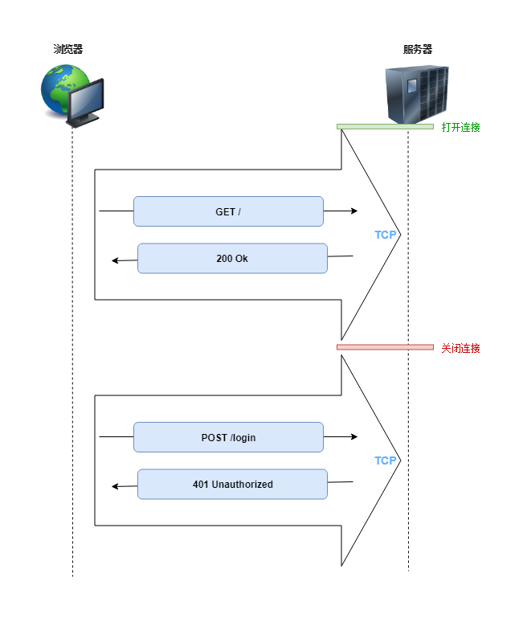

# 浏览器实时通信websocket

在介绍 Websocket 之前，先了解一些 HTTP 的基础知识，毕竟 Websocket 本身是借用 HTTP 协议实现的。

HTTP 协议是基于 TCP/IP 之上的应用层协议，也就是说 HTTP 在 TCP 连接中进行请求和响应的，**浏览器会为每个请求建立一个 TCP 连接，请求等待服务端响应，在服务端响应后关闭连接**：



后来人们发现为每个 HTTP 请求都建立一个 TCP 连接，太浪费资源了，能不能不要着急关闭 TCP 连接，而是将它复用起来，在一个 TCP 连接中进行多次请求。

这就有了 HTTP 持久连接(HTTP persistent connection，也称为 HTTP keep-alive)，它利用同一个 TCP 连接来发送和接收多个 HTTP 请求/响应。持久化连接的方式可以大大减少等待时间，双方不需要重新运行 TCP 握手，这对前端静态资源的加载有很大意义：


回到 Websocket，**浏览器端用户程序并不支持和服务器端直接建立 TCP 连接，但是上面我们看到每个 HTTP 请求都会建立 TCP 连接，TCP 是可靠的、全双工的数据通信通道，那我们为什么不直接利用它来进行实时通信？这就是 Websocket 的原理！**

我们通过一张图，通俗地理解一下 Websocket 的原理：


从上图可以看到，`Websocket 除最初建立连接时需要借助于现有的 HTTP 协议，其他时候直接基于 TCP 完成通信`。这就是浏览器中最接近套接字的 API，可以实时和服务端进行全双工通信。Websocket 相比传统的浏览器的 Comet 技术，有很多优势：

- 更强的实时性。基于 TCP 协议的全双工通信
- 更高效。一方面是数据包相对较小，另一方面相比传统 XHR-Streaming 和轮询方式更高效，不需要重复建立 TCP 连接
- 更好的二进制支持。Websocket 定义了二进制帧，相对 HTTP，可以更轻松地处理二进制内容
- 保持连接状态。相比 HTTP 无状态的协议，Websocket 只需要在建立连接时携带认证信息，后续的通信都在这个绘画内进行
- 可以支持扩展。Websocket 定义了扩展，用户可以扩展协议、实现部分自定义的子协议。如部分浏览器支持压缩等

它的接口也很简单：

```js
const ws = new Websocket('ws://localhost:8080/socket');

// 错误处理
ws.onerror = (error) => {...}

// 连接关闭
ws.onclose = () => {...}

// 连接建立
ws.onopen = () => {
  // 向服务端发送消息
  ws.send('ping')
}

// 接收服务端发送的消息
ws.onmessage = (msg) => {
  if (msg.data instanceof Blob) {
    // 处理二进制信息
    processBlob(msg.data);
  } else {
    // 处理文本信息
    processText(msg.data);
  }
}
```

Websocket 常见问题：

- 浏览器兼容性
  - IE 10 以下不支持
  - Safari 下不允许使用非标准接口建立连接
- 心跳。Websocket 本身不会维护心跳机制，一些 Websocket 实现在空闲一段时间会自动断开
- 一些负载均衡或代理不支持 websocket

##### 扩展

- [Websocket](https://zh.wikipedia.org/wiki/WebSocket)
- [Websocket 解析](https://mp.weixin.qq.com/s/7aXMdnajINt0C5dcJy2USg?)
- [阮一峰：Websocket 教程](http://www.ruanyifeng.com/blog/2017/05/websocket.html)