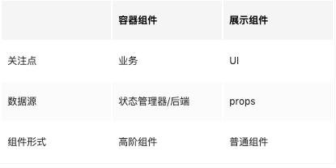
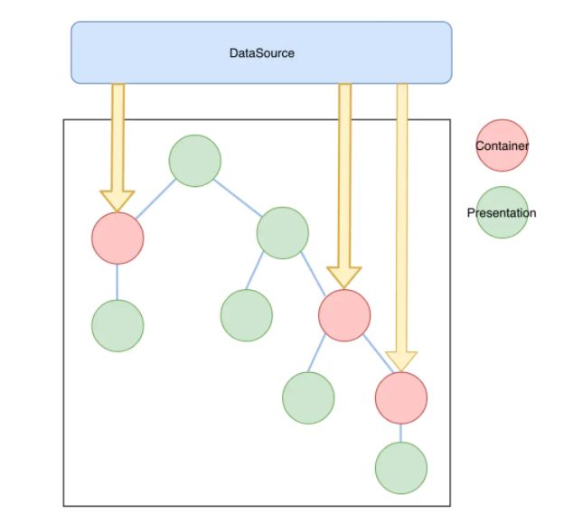
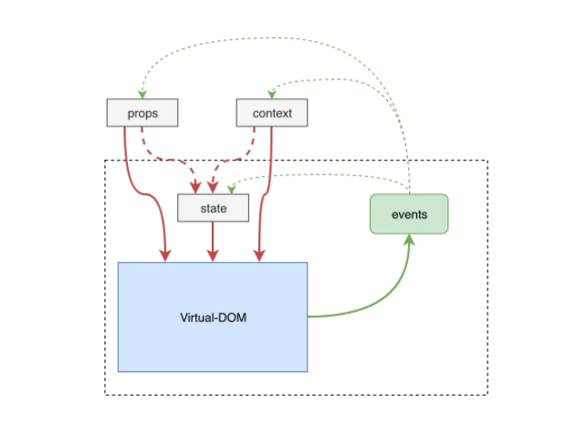
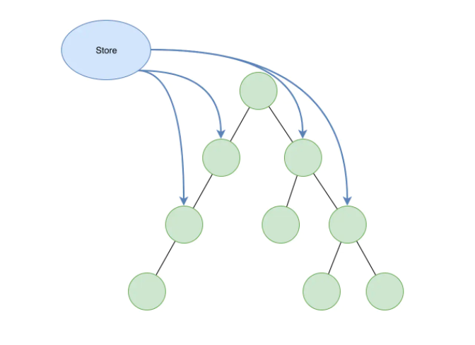
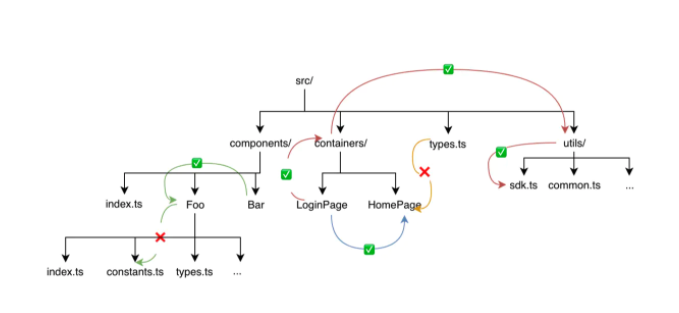

# React组件设计02-组件的组织

## 1. 组件设计的基本原则

### 基本原则

`单一职责(Single Responsibility Principle)`：一个类只负责一件事情，只要是模块化的程序设计都适用单一职责原则，在React中，组件就是模块。

`单一职责`要求将组件限制在一个`合适`的粒度。换句话说`单一职责要求的是一个适合被复用的粒度`。

对于入门者来说`Don't repeat yourself`原则更有用，`不要偷懒/多思考/重构/消除重复代码，你的能力就会慢慢提升`

单一职责的收益：

- 降低组件的复杂度，职责单一组件代码量少，容易被理解，可读性高
- 降低对其他组件的耦合，当变更到来时可以降低对其他功能的影响，不至于牵一发而动全身
- 提高可复用性，功能越单一复用性越高，就比如一些基础组件

### 高质量组件的特征

一个高质量组件一定是`高内聚，低耦合`的，这两个原则或特征是组件独立性的一个判断标准。

`高内聚`要求一个组件有一个明确的组件边界，将紧密相关的内容聚集在一个组件下，实行专一的功能。

虽然组件是独立的，但是她需要和其他组件进行组合才能实现应用，这就有了关联，`低耦合`要求最小化这种关联性，比如明确模块边界不应该访问其他组件的内部细节，组件的接口最小化，单向数据流等

## 2. 基本技巧

- 如果组件不需要状态，则使用`无状态组件`
- 性能上比较：`无状态函数` > `有状态函数` > `class 组件`
- 最小化 props(接口)，不要传递超过要求的 props
- 如果组件内部存在较多条件控制流，这通常意味着需要对组件进行抽取
- 不要过早优化，只要求组件在当前需求下可被复用，然后随机应变

## 3. 组件的分类

### 容器组件和展示组件分离

`容器组件和展示组件分离是React开发的重要思想，它影响的React应用项目的组织和架构。`区别如下：



#### 展示组件

`展示组件`是一个只关注展示的`元件`，为了可以在多个地方被复用，它不应该耦合`业务/功能`，或者说不应该过度耦合，像`antd`这类组件库提供的通用组件显然就是`展示组件`。

对于展示组件，我们要以一种`第三方组件库`的标准来考虑组件的设计，减少与业务的耦合度，考虑各种应用的场景，设计好公开的接口。

#### 容器组件

`容器组件`主要关注业务处理，容器组件一般以`高阶组件`形式存在，它一般从外部数据源(redux这些状态管理器或者直接请求服务端数据)获取数据，然后组合展示组件来构建完整的视图。



`容器组件和展示组件的分离`可以带来的好处是`可复用性`和`可维护性`：

- 可复用性：展示组件可以用于多个不同的数据源(容器组件)，容器组件(业务逻辑)也可以被复用于不同平台的展示组件
- 展示和容器组件更好的分离，有助于更好地理解应用和UI，两者可以被独立地维护
- 展示组件变得轻量(无状态/局部状态)，更容易被测试

### 分离逻辑和视图

`容器组件和展示组件`的分离本质上是`逻辑和视图`的分离，在`React Hooks`出现后，容器组件可以被Hooks形式取代，Hooks可以和视图层更自然的分离，为视图层提供纯粹的数据来源。

分离逻辑和视图的主要方式有：

- hooks
- 高阶组件
- Render Props
- Context

### 有状态组件和无状态组件

`无状态组件内部不存储状态，完全由外部的props来映射`。这类组件以`函数组件`形式存在，作为低级/高复用的底层展示型组件，无状态组件天然就是`纯组件`，如果无状态组件的映射需要一点成本，可以使用`React.memo`包裹避免重复渲染

### 纯组件和非纯组件

`纯组件`的纯来源于函数式编程，指的是`对于一个函数而言，给定相同的输入，它总是返回相同的输出，过程没有副作用，没有额外的状态依赖`。对应到React中，`纯组件指的是props(严格上说还有state和context，它们也是组件的输入)没有变化，组件的输出就不会变动`。



函数式编程和组件式编程思想某种意义上是一致的，它们都是组合的艺术。一个大的函数可以有多个职责单一函数组合而成，组件也是如此。**我们将一个大的组件拆分为子组件，对组件做更细粒度的控制，保持它们的纯净性，让它们的职责更单一，更独立。这带来的好处就是`可复用性、可测试性和可预测性`。**

`纯组件对React的性能优化也有重要意义`。如果一个组件是一个纯组件，如果输入没有变动，那么这个组件就不需要重新渲染，组件树越大，纯组件带来的性能优化收益就越高。

我们可以很容易地保证一个底层组件的纯净性，因为它本来就很简单，但是对于一个复杂的组件树，则需要花心思进行构建，所以有了`状态管理`的需求。**这些状态管理器通常都在组件树的外部维护一个或多个状态库，然后通过依赖注入形式，将局部的状态注入到子树中，通过视图和逻辑分离的原则，来维护组件树的纯净性。**

`Redux`就是一个典型的解决方案，在Redux的世界里可以认为`一个复杂的组件树就是一棵状态树的映射`，只要状态树不变(需要依赖不可变数据来保证状态的可预测性)，组件树就不变。`Redux建议保持组件的纯净性，将组件状态交给Redux和配套的异步处理工具(redux+dva)来维护`，这样就将整个应用抽象成了一个`单向的数据流`，这是一种简单的输入/输出关系。



### 按照UI划分为布局组件和内容组件

- `布局组件`用于控制页面的布局，为内容组件提供占位。通过props传入组件来进行填充，比如`Grid`、`Layout`、`HorizontalSplit`
- 内容组件会包含一些内容，而不仅有布局。内容组件通常被布局组件约束在占位内。比如`Button`、`Label`、`Input`

将布局从内容组件中抽取出来，分离布局和内容，可以让两者更好维护，比如布局变动不会影响内容，内容组件可以被应用不同的布局；另一方面组件是一个自包含内聚的隔离单元，不应该影响其外部的状态，例如一个按钮不应该修改外部的布局，另外也要避免影响全局的样式。

### 接口一致的数据录入组件

`数据录入组件，或者称为表单`，是客户端开发必不可少的元素，对于自定义表单组件，应该保持一致的API：

```js
interface Props<T> {
  value?: T;
  onChange: (value?: T) => void;
}
```

这样做的好处：

- 接近原生表单元素原语，自定义表单组件一般不需要封装到event对象中
- 几乎所有组件库的自定义表单都使用这种API，这使得我们的自定义组件可以和第三方库兼容，比如`antd的表单验证机制`
- 更容易被动态渲染，因为接口一致，可以方便地进行动态渲染或集中化处理，减少代码重复
- 回显问题，状态回显是表单组件的功能之一，最佳实践应该是value应该是自包含的：

比如一个支持搜索的用户选择器, option 都是异步从后端加载, 如果 value 只保存用户 id, 那么回显的时候就无法显示用户名, 按照我的实践的 value 的结构应该为: `{id: string, name: string}`, 这样就解决了回显问题. 回显需要的数据都是由父节点传递进来, 而不是组件自己维护

- 组件都是受控的，只提供完全受控表单组件，避免组件自己维护缓存状态


## 4. 模块

### 创建严格的模块边界

应该创建严格的模块边界，`一个模块只有一个统一的出口`。例如一个复杂的组件：

```shell
ComplexPage/
  components/
    Foo.tsx
    Bar.tsx
  constants.ts
  reducers.ts
  style.css
  types.ts
  index.tsx # 出口
```

可以认为一个目录就是一个模块边界，你不应该这样导入模块：

```js
import ComplexPage from '../ComplexPage';
import Foo from '../ComplexPage/components/Foo';
import Foo from '../ComplexPage/components/Bar';
import { XXX } from '../ComplexPage/components/constants';
import { User, ComplexPageProps } from '../ComplexPage/components/type';
```

**一个模块/目录应该由一个出口文件来统一管理模块的导出，限定模块的可见性。**比如上面的模块，`Components/Foo`、`Components/Bar`和`constants.ts`这些文件都是`ComplexPage`组件的实现细节，这些事外部模块不应该去耦合实现细节，但是这个在语言层面并没有一个限定机制，只能依靠规范约定。

>当其他模块依赖某个模块的细节时，可能是一种重构的信号：比如依赖一个模块的一个工具函数或者是一个对象类型声明，这时候可能应该将其抬升到父级模块，让兄弟模块共享它

在前端项目中`index`文件最适合作为一个出口文件，当导入一个目录时，模块查找器会查找该目录下是否存在`index`文件，开发者设计一个模块的API时，需要考虑模块各种使用方式，并使用`index`文件控制模块可见性：

```js
import ComplexPage, { ComplexPageProps, User, XXX } from '../ComplexPage';
```

**但是不是所有目录都有出口文件，这时候目录就不是模块的边界了。**典型的有`utils/`，`utils`只是一个模块命名空间，`utils`下面的文件都是一些互不相关或者不同类型的文件，`我们习惯直接引用这些文件，而不是通过一个入口文件，这样可以更明确导入的是什么类型的`：

```js
import { hide } from './utils/dom'; // 通过文件名可以知道, 这可能是隐藏某个DOM元素
import { hide } from './utils/sdk'; // webview sdk 提供的的某个方法
```

`模块边界原则`(如下图)：**一个模块可以访问兄弟(同个作用域下)、祖先及祖先的兄弟模块**，例如：



- Bar可以访问Foo，但是不能再向下访问它的细节，即不能访问`../Foo/types.ts`，但可以访问它的出口文件`../Foo`
- src/types.ts 不能访问 containers/HomePage
- LoginPage 可以访问 HomePage
- LoginPage 可以访问 utils/sdk

### Named export VS default export

**named export 优点**：

- 命名确定

  - 方便TypeScript进行重构
  - 方便只能提醒和自动导入(auto-import)识别
  - 方便reexport

  ```js
  // named
  export * from './named-export';
  
  // default
  export { default as Foo } from './default-export';
  ```

- 一个模块支持多个`named export`

**default export 优点**：

- `default export` 的导入语句更加简洁。例如`lazy(import('./MyPage'))`

**default export 缺点**：

- 和其他模块机制(commonjs)互操作时比较难以理解。例如我们会这样子导入`default export`: `require('./xx').default`
- `named export`优点就是`default export`缺点

**总结**：

- 对于`主体对象明确`的模块需要有默认导出，例如页面组件，类
- 对于`主体对象不明确`的模块不应该使用默认导出，例如组件库、utils(放置各种工具方法)、contants 常量

例如：

components目录为：

```shell
  components/
    Foo/
      Foo.tsx
      types.ts
      constants.ts
      index.ts         # 导出Foo组件
    Bar/
      Bar.tsx
      index.tsx
    index.ts           # 导出所有组件

```

对于Foo模块来说，存在一个主体对象Foo，所以这里使用`default export`导出Foo组件：

```js
// index.tsx
// 这三个文件全部使用named export导出
export * from './contants';
export * from './types';
export * from './Foo';

// 导出主体对象
export { Foo as default } from './Foo';

```

假设 Bar 组件依赖于 Foo：

```js
// components/Bar/Bar.tsx
import React from 'react';

// 导入Foo组件, 根据模块边界规则, 不能直接引用../Foo/Foo.tsx
import Foo from '../Foo';

export const Bar = () => {
  return (
    <div>
      <Foo />
    </div>
  );
};

export default Bar;
```

对于`components`模块来说，它的所有子模块都是平等的，所以不存在一个主体对象，`default export`在这里不适用，应该使用`named export`，`components/index.ts`代码如下：

```js
// components/index.ts
export * from './Foo';
export * from './Bar';
```

### 避免循环依赖

### 相对路径不要超过两级