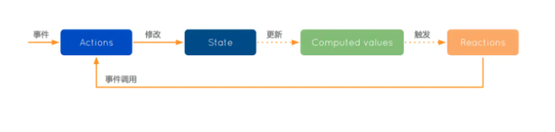
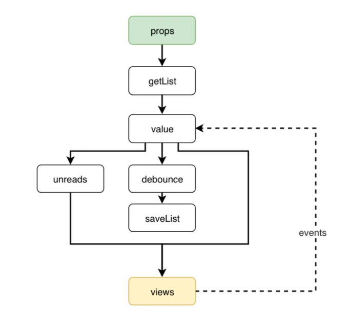

# React组件设计04-组件的思维

## 1. 高阶组件

高阶组件可以定义为：**高阶组件是函数，它接收原始组件并返回原始组件的增强/填充版本**：

```js
const HOC = Component => EnhancedComponent;
```

**为什么需要高阶组件**：

- 逻辑复用。把一些通用的代码逻辑提取出来放到高阶组件中，让更多组件可以共享
- 分离关注点。高阶组件可以作为实现“逻辑和视图分离”原则的载体，我们一般将行为层或者业务层抽取到高阶组件中来实现，让展示组件只关注于UI

**高阶组件实现方法**：

- `属性代理(Props Proxy)`：代理传递给被包装组件的 props，对 props进行操作，这种方式用得最多，使用这种方式可以做到：

  - 操作 props
  - 访问被包装组件实例
  - 提取 state
  - 用其他元素包裹被包装组件

- `反向继承(Inheritance Inversion)`：高阶组件继承被包装的组件。例如：

  ```js
  function myhoc(WrappedComponent) {
    return class Enhancer extends WrappedComponent {
      render() {
        return super.render();
      }
    };
  }
  ```

  可以实现：

  - 渲染劫持：即控制被包装组件的渲染输出
  - 操作 state：state 一般属于组件的内部细节，通过继承的方式可以暴露给子类，可以增删查改被包装组件的 state，**除非你知道你在干什么，否则不建议这么做**

**应用场景**：

- `操作 props`：增删查改 props。例如转换 props，扩展 props，固定 props，重命名 props
- `依赖注入`：注入 context 或外部状态和逻辑，例如 redux 的 connect，react-router 的 withRouter
- `扩展 state`：例如给函数式组件注入状态
- `避免重复渲染`：例如 React.memo
- `分离逻辑`：让组件保持 dumb

**规范**:

- 包装显示名字以便于调试
- 使用 React.forwardRef 来转发 ref
- 使用`高阶函数`来配置`高阶组件`，这样可以让高阶组件的组合性最大化。Redux 的 connect 就是典型的例子：

```js
const ConnectedComment = connect(commentSelector, commentActions)(Comment);
```

当使用 compose 进行组合时就能体会到它的好处：

```js
// 🙅 不推荐
const EnhancedComponent = withRouter(connect(commentSelector)(WrappedComponent));

// ✅ 使用compose方法进行组合
// compose(f, g, h) 和 (...args) => f(g(h(...args)))是一样的
const enhance = compose(
  // 这些都是单独一个参数的高阶组件
  withRouter,
  connect(commentSelector),
);

const EnhancedComponent = enhance(WrappedComponent);

```

- 转发所有不相关 props 属性给被包装的组件

```js
render() {
  const { extraProp, ...passThroughProps } = this.props;
  // ...
  return (
    <WrappedComponent injectedProp={injectedProp} {...passThroughProps} />
  )
}
```

- 命名：一般以 `with*`命名，如果携带参数，则以`create*`命名

## 2. Render Props

`Render Props(Function as Child)` 也是一种常见的 react 模式，比如官方的 Context API 和 react-spring 动画库。

**Render Props 定义**：

>是指一种在 React 组件之间使用一个值为函数的 props 在 React 组件间共享代码的简单技术

React 并没有限定任何 props 的类型，所以 props 也可以是函数形式，`当 props 为函数时，父组件可以通过函数参数给子组件传递一些数据进行动态渲染`。典型代码为：

```js
<FunctionAsChild>{() => <div>Hello, React</div>}</FunctionAsChild>
```

使用示例：

```js
<Spring from={{ opacity: 0}} to={{ opacity: 1}}>
  {props => <div style={props}>hello</div>}
</Spring>
```

这种模式相比高阶组件要简单得多，但是**缺点**也很明显：

- `可读性差`，尤其是多层嵌套情况下
- `组合性差`，只能通过 JSX 一层一层嵌套，一般不宜多于一层
- `适用于动态渲染`，因为局限在 JSX 节点中，当前组件是很难获取到 render props 传递的数据。如果要传递给当前组件还是得通过 props，也就是通过高阶组件传递进来

## 3. 使用组件的方式来抽象业务逻辑

大部分情况下，组件表示是一个 UI 对象，其实组件不单单可以表示 UI，也可以用来抽象业务对象，有时候抽象为数组可以巧妙地解决一些问题。

**比如**：

>当一个审批人在审批一个请求时，请求发起者是不能重新编辑的；反之发起者在编辑时，审批人不能进行审批，这是一个`锁定机制`，后端一般使用类似心跳机制来维护这个锁，这个锁可以显式释放，也可以在超过一定时间没有激活时自动释放，比如页面关闭，所以前端通常会使用`轮询机制`来激活锁

一般的实现：

```js
class MyPage extends React.Component {
  componentDidMount() {
    // 根据一些条件触发，可能还要监听这些条件的变化，然后停止加锁轮询
    if (someCondition) {
      this.timer = setInterval(async () => {
        // 轮询
        tryLock();
        // 错误处理，可以加锁失败
      }, 5000)
    }
  }
  
  componentWillUnmount() {
    clearInterval(this.timer);
    // 页面卸载时显示释放
    releaseLock();
  }
  
  componentDidUpdate() {
    // 监听条件变化，开始或停止锁定
    // ...
  }
}
```

将条件锁定功能Locker抽象成组件：

```js
// 锁定器
const Locker: FC<{ onError: err => boolean, id: string}> = props => {
  const { id, onError } = props;
  useEffect(() => {
    let timer;
    const poll = () => {
      timer = setTimeout(async () => {
        // ...
        // 轮询，处理异常等情况
      }, 5000)
    }
    
    poll();
    
    return () => {
      clearTimeout(timer);
      releaseLock();
    }
  }, [id])
  
  return null;
}
```

使用Locker：

```js
render() {
  retrn (
  	<div>
    	{someCondition && <Locker id={this.id} onError={this.handleError} />}
    </div>
  )
}
```


## 4. hooks 取代高阶组件

`hooks解决了高阶组件或者 Render Props 的痛点`：

- **很难再组件之间复用状态逻辑**
  - **问题**：React框架本身并没有提供一种将可复用的逻辑注入到组件上的方式/原语，RenderProps 和高阶组件只是`模式层面(或者说语言层面)`的东西
  - **此前解决方案**：高阶组件和 Render Props，这些方案都是基于组件本身的机制
    - 高阶组件和 Render Props 会造成多余的节点嵌套，即 Wrapper hell(嵌套地狱)
    - 需要调整你的组件结构，会让代码变得笨重，且难以理解
    - 高阶组件复杂，难以理解
    - 高阶组件也要 ref 转发问题等
  - **hooks 解决方案**：
    - 将状态逻辑从组件中脱离，让它可以被单独地测试和复用
    - hooks 可以在组件之间共享，不会影响组件的结构
- **复杂的组件难以理解**：复杂组件的特点是有一大堆分散的状态逻辑和副作用。例如每个生命周期函数常常包含一些互补相关的逻辑，这些互不相关的逻辑会慢慢变成面条式的代码，但是你发现很难再对它们进行拆解
  - **问题**：在实际情况中，我们很难将这些组件分解成更小的组件，因为状态到处都是，测试它们也很困难；精彩导致过分抽象，比如 redux 需要在多个文件中跳转，需要写很多模板文件和模板代码
  - **此前解决方案**：高阶组件和 Render Props 或者状态管理器，分割抽离逻辑和 UI，切割成更小粒度的组件
  - **hooks 解决方案**：hooks 允许你根据相关部分(例如设置订阅或获取数据)将一个组件分割成更小的函数，而不是强制基于生命周期方法进行分割；你还可以选择使用一个 reducer 来管理组件的本地状态，以使其更加可预测
- 基于 class 的组件对机器和用户都不友好
  - **问题**：
    - 对于人： 需要理解 this，代码冗长
    - 对于机器：不好优化
  - **hooks 解决方案**：函数式组件
  - **新的问题**：你要了解闭包

`hooks 带来的新东西：hooks 旨在让组件的内部逻辑组织成可复用的更小单元，这些单元各自维护一部分组件“状态和逻辑”`

- **一种新的组件编写方式**：hooks 提供了更简洁的 API 和代码复用机制，这使得组件代码变得更简短
- **更细粒度的状态控制(useState)**：以前一个组件只有一个setState 集中式管理组件状态，现在 hooks 像组件一样，是一个逻辑和状态的聚合单元，这意味着不同的 hooks 可以维护自己的状态
- **不管是 hooks 还是组件，都是普通函数**：
  - 从某种程度上看，组件和 hooks 是同质的(都包含状态和逻辑)
  - 函数是一种最简单的代码复用单元，最简单也就意味着更灵活
  - 本质上讲，hooks 就是给函数带来了状态的概念
- **高阶组件之间只能简单嵌套复合(compose)，而多个 hooks 之间是平铺的，可以定义更复杂的关系(依赖)**
- **更容易进行逻辑和视图分离**：hooks 天然隔离 JSX，视图和逻辑之间的界限比较清晰，这使得 hooks 可以更专注组件的行为
- **淡化组件生命周期概念，将本来分散在多个生命周期的相关逻辑聚合起来**
- **一点点“响应式编程”的味道**
- **跨平台的逻辑复用**

`注意事项`：

- 只能在顶层调用 hooks。不要在循环，控制流和嵌套的函数中调用 hooks
- 只能从 React 的函数组件中调用 hooks
- 自定义 hooks 使用`use*`命名

`hooks 的常用场景`：

- **副作用封装和监听**：例如 useWindowSize(监听窗口大小)、useOnlineStatus(在线状态)
- **副作用衍生**：useEffect、useDebounce、useThrottle、useTitle、useSetTimeout
- **DOM 事件封装**：useActive、useFocus、useDraggable、useTouch
- **获取 context**
- **封装可复用逻辑和状态**：useInput、usePromise(异步请求)、useList(列表加载)
  - 取代高阶组件和 render Props。例如使用 useRouter 取代 withRouter，useSpring 取代旧的 Spring Render Props 组件
  - 取代容器组件
  - 状态管理器：use-global-hook、unstated
- **扩展状态操作**：原始的 useState 很简单，所以有很大的扩展空间，例如 useSetState(模拟旧的 setState)、useToggle(boolean 值切换)、useArray、useLocalStorage(同步持久化到本地存储)

## 5. hooks 实现响应式编程

hooks 让组件的状态管理变得更简单直接，而且它的思想也很接近 mobx 响应式编程哲学：



- **简洁地声明状态**

`状态`是驱动应用的数据，例如 UI 状态或者业务领域状态

```js
function Demo() {
  const [list, setList] = useState<Item[]>([]);
  // ...
}
```


- **衍生**

`任何源自状态并且不会再有任何进一步的相互作用的东西就是衍生`。包括用户视图、衍生状态、其他副作用

```js
function Demo(props: { id: string }) {
  const { id } = props;
  // 取代 mobx 的 observable：获取列表，在挂载或 id 变动时请求
  const [value, setValue, loading, error, retry] = usePromise(async id => {
    return getList(id)}, [id]
  );
  
  // 衍生状态：取代 mobx 的 computed
  const unreads = useMemo(() => value.filter(i => !i.readed), [value]);
  
  // 衍生副作用：value 变动后自动持久化
  useDebounce(() => {
    saveList(id, value)
  }, 1000, [value]);
  
  // 衍生视图
  return <List data={value} onChange={setValue} error={error} loading={loading} retry={retry}/>
}
```




## 6. 使用 Context 进入依赖注入

`Context 为组件树提供了一个传递数据的方法，从而避免了在每一个层级手动的传递 props 属性`

Context 在React 应用中使用非常频繁，Context 常用于以下场景：

- **共享那些被认为对于一个组件树而言时全局的数据**：如当前认证的用户、主题、i18n 配置、表单状态
- **组件配置**：配置组件的行为，如 antd 的 ConfigProvider
- **跨组件通信**：不推荐通过事件进行通信，而是通过状态进行通信
- **依赖注入**
- **状态管理器**：Context 经过一些封装可以基本取代 Redux 和 Mobx 这些状态管理方案

`Context 的作用域是子树，也就是说一个 Context Provider 可以应用于多个子树，子树的 Provider 也可以覆盖父级的 Provider 的 value`，基本结构：

```js
import React, { useState, useContext } from 'react';

export interface MyContextValue {
  state: number;
  setState: (state: number) => void;
}

const MyContext = React.createContext<MyContextValue>({
  state: 1,
  // 设置默认值，抛出错误，必须配合 Provider 使用
  setState: () => throw new Error('请求 MyContextProvider 组件下级调用')
})

export const MyContextProvider: React.FC<{}> = props => {
  const [state, setState] = useState(1);
  return <MyContext.Provider value={{state, setState}}>{props.children}</MyContext.Provider>
}

export function useMyContext() {
  return useContext(MyContext);
}

export default MyContextProvider;
```

>Context 默认值中的方法应该抛出错误，警告不规范的使用

## 7. 不可变的状态

对于函数式编程范式来说，`不可变状态`有重要的意义：

- **不可变数据具有可预测性**。不可变数据可以让应用更好调试，对象的变更更容易被跟踪和推导

>比如 Redux 它要求只能通过 dispatch + reducer 进行状态变更，配合它的 Devtool 可以很好地跟踪状态是如何变更的，这个特性对于大型应用来说意义重大，因为它的状态非常复杂，如果不加以组织和约束，你不知道是哪个地方修改了状态，出现 bug 时很难跟踪

- **不可变数据还使一些复杂的功能更容易实现**。避免数据改变，使我们能够安全保留对旧数据的引用，可以方便地实现撤销重做，或者时间旅行这些功能
- **可以精确地进行重新渲染判断**。可以简化 shouldComponentUpdate 比较

实现不可变数据的流行方法：

- [immer](https://github.com/immerjs/immer)

