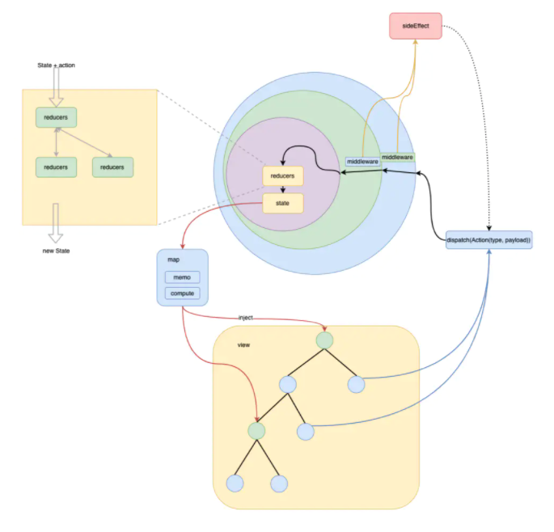

# React组件设计05-状态管理

## 状态管理

现在的前端框架，包括 React 的一个核心思想就是`数据驱动视图，即 UI = f(state)`，这种开发方式的变化得益于Virtual-DOM，它使得我们不需要关心浏览器底层 DOM 的操作细节，只需关心`状态(state)`和`状态到 UI 的映射关系(f)`。

但是随着 `state` 的复杂化：

- 框架现有的组件化方式很难驾驭 `f`(视图的映射关系变得复杂，难以被表达和维护；
- 或者相关类型的应用数据流本来就复杂，组件之间的交互关系多样，本来难以使用 `UI = f(state)` 这种关系来表达；
- 或者应用的组件状态过于离散，需要统一的治理等

于是我们就有了`状态管理`的需求

`状态管理`最基础的解决方式是`分层`，也就是说和传统的 `MV*` 模式没有本质区别，主流状态管理的主要结构基本是这样的：


它们基本都包含以下这些特点：

- **分离视图和状态**：状态管理器擅长状态管理，所以一般会将应用状态聚合在一起管理，而视图退化为贫血视图(只关注展示)，这样就可以简化 `f` 映射关系，让`UI = f(state)` 这个表达式更彻底
- **约束状态的变更**：Redux 要求通过 `dispatch + reducer` ，mobx 要求数据变更函数使用 `action` 装饰或放在 `flow` 函数中，目的就是让状态的变更根据可预测性
- **单向数据流**：数据流总是按照 Store -> View -> Store 这样的方式流动，简化数据流

## 是否需要状态管理

对于大部分简单的应用和中后台项目来说是`不需要状态管理`的。

**在考虑引用状态管理之前考虑一下这些手段是否可以解决你的问题**：

- 是否可以通过抬升 `State` 来实现组件间通信？
- 如果跨越的层级太多，数据是否可以通过 `Context API` 来实现共享？
- 一些全局状态是否可以放在 `localStorage` 或 `sessionStorage` 中？
- 数据是否可以通过外置的`事件订阅器`进行共享？

**当你的应用有以下场景时，就要开始考虑状态管理**：

- `组件之间需要状态共享`。同一份数据需要响应到多个视图，且被多个视图进行变更
- `需要维护全局状态，并在它们变动时响应到视图`。
- `数据流变得复杂，React 组件本身已经无法驾驭`。例如跨页面的用户协作
- `需要统一管理应用的状态`。比如实现持久化、可恢复、可撤销/重做

**使用 hooks 作为状态管理器的优点**：

- 极简
- 可组合性
- hooks 很多灵活的特性足以取代类似 Mobx 这些框架的大部分功能
- 强类型
- 基于 Context API 更容易实现模块化

**需要注意的地方**：

- 没有外置的状态。状态在组件内部，没有办法从外部触发状态变更
- 缺少约束。
- 性能优化。需要考虑 Context 变更带来的性能问题
- 调试体验不如 Redux
- 没有数据镜像，不能实现诸如事件管理的需求
- 没有 Redux 丰富的生态

`Context + Hooks 可以用于满足简单的状态管理需求，对于复杂的状态管理需求可以使用 Redux/Mobx 等专业的状态管理器`

## Redux



Redux 主要结构如上，**Redux 主要为了解决以下问题**：

- `可预测状态`
- `简化应用数据流`

**Redux 设计**:

- `单一数据源 -> 可预测，简化数据流`：数据只能在一个地方被修改
  - 可以简化应用数据流。解决传统多 model 模型数据流混乱问题(比如一个 model 可以修改其他 model，一个 view 受到多个 model 驱动)，让数据变动变得可预测可调试
  - 同构化应用开发
  - 方便调试
  - 方便做数据镜像。可以实现撤销/重做、时间旅行、热重载、状态持久化和恢复
- `单一数据流 -> 简化数据流，可预测`
- `不能直接修改状态 -> 可预测`
  - 只能通过 dispatch action 来触发状态变更。action 只是一个简单的对象，携带事件的类型和 payload
  - reducer 接收 action 和旧的 state，规约生成新的 state。reducer 只是一个纯函数，可以嵌套组合子 reducer 对复杂 state 树进行规约
  - 不可变数据
  - 可测试
- `范式化和反范式化`。Store 只存储范式化的数据，减少数据冗余。视图需要的数据通过 reselect 等手段反范式化
- `通过中间件隔离副作用 -> 可预测`。可以说 Redux 的核心概念就是 reducer，然而这是一个纯函数。为了实现复杂的副作用，redux 提供了类似 Koa 的中间件机制，实现各种副作用。比如异步请求，除此之外，可以利用中间件机制，实现通用的业务模式，减少代码重复。
- `Devtool -> 可预测`。通过开发者工具可以可视化数据流

#### 什么时候应该使用 Redux

**当我们需要处理复杂的应用状态，且 React 本身无法满足你时**，比如：

- 需要持久化应用状态，这样你可以从本地存储或服务器返回数据中恢复应用
- 需要实现撤销重做这些功能
- 实现跨页面的用户协作
- 应用状态很复杂时
- 数据流比较复杂时
- 许多不相关的组件需要共享和更新状态
- 外置状态

#### 最佳实践

[react-boilerplate](https://github.com/react-boilerplate/react-boilerplate/blob/master/docs/general/introduction.md)是最符合官方**最佳实践**的项目模板，它的应用工作流如下：


特性：

- 整合了 Redux 生态比较流行的方案：`immer`(不可变数据变更)、`redux-saga`(异步数据流处理)、`reselect`(选取和映射 state，支持 memo，可复合)、`connected-react-router`(绑定 react-router v4)
- 根据页面分割 saga 和 reducer
- 按需加载 saga 和reducer(通过 replaceReducer)
- 划分容器组件和展示组件

react-boilerplate 目录结构，组织非常清晰，很有参考意义：

```shell
/src
  /components        # 展示组件
  /containers        # 🔴容器/页面组件
    /App             # 根组件， 例如放置Provider和Router
    /HomePage        # 页面组件
      index.js       # 页面入口
      constants.js   # 🔴 在这里定义各种常量。包括Action Type
      actions.js     # 🔴 定义各种Action函数
      saga.js        # 🔴 redux-saga 定义各种saga方法， 用于处理异步流程
      reducer.js     # 🔴 reducer。 页面组件的reducer和saga都会按需注入到根store
      selectors.js   # 🔴 redux state映射和计算
      message.js
      Form.js        # 各种局部组件
      Input.js
      ...
    /FeaturePage     # 其他页面组件结构同上
    ...
  /translations      # i18n 翻译文件
  /utils
    reducerInjectors.js  # 🔴reducer 注入器, 实现和页面组件一起按需注入
    sagaInjectors.js     # 🔴saga 注入器, 同上
    lodable.js
  app.js             # 应用入口
  i18n.js            # i18n配置
  configureStore.js  # 🔴 创建和配置Redux Store
  reducers.js        # 🔴 根reducers, 合并所有'页面状态'和'全局状态'(如router， language， global(例如用户鉴权信息))

```

#### 关于 Redux 的吐槽

- Redux 核心库很小，只提供了 dispatch 和 reducer 机制，对各种复杂的副作用处理，Redux 通过提供中间件机制外包出去。对于Redux 目前比较流行的组合就是：immer + saga + reselect
- 太多模板代码。比如需要定义各种 Action、Type、Reducer、Saga、Select
- 强制不可变数据。
- 不方便 TypeScript 类型化。