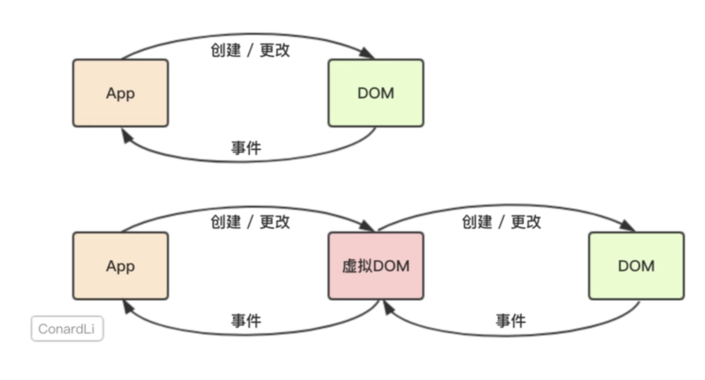

# React虚拟DOM



## 什么是虚拟DOM

在原生的`JavaScript`程序中，我们直接对`DOM`进行创建和更改，而`DOM`元素通过我们监听的事件和我们的应用程序进行通讯。

而`React`会先将你的代码转换成一个`JavaScript`对象，然后这个`JavaScript`对象再转换成真实`DOM`。这个`JavaScript`对象就是所谓的虚拟`DOM`。

例如`html`代码

```html
<div class="title">
  <span>Hello world</span>
  <ul>
    <li>苹果</li>
    <li>橘子</li>
  </ul>
</div>
```

在`React`中存储为这样的`JS`代码

```js
const VitualDom = {
  type: 'div',
  props: {
    class: 'title'
  },
  children: [
    {
      type: 'span',
      children: 'Hello world'
    },
    {
      type: 'ul',
      children: [
        {
          type: 'li', children: '苹果',
          type: 'li', children: '橘子'
        }
      ]
    }
  ]
}
```

当我们需要创建或更新元素时，React首先会让这个`VitualDom`对象进行创建和更改，然后再将`VitualDom`对象渲染成真实`DOM`。当我们需要对`DOM`进行事件监听时，首先对`VitualDom`进行事件监听，`VitualDom`会代理原生的`DOM`事件从而做出响应。

## 虚拟DOM原理


   

## 为什么使用虚拟DOM

- 提高开发效率

使用`JavaScript`，我们在编写应用程序时的关注点在于如何更新`DOM`。

使用`React`，你只需要告诉React，你想让视图处于什么状态，React则通过`VitualDom`确保DOM与该状态相匹配。React会替你完成属性操作、事件处理、DOM更新等操作。`VitualDom`的优势在于React的`Diff`算法和批处理策略，React在页面更新之前，提前计算好了如何进行更新和渲染DOM。

- 跨浏览器兼容

React基于`VitualDom`自己实现了一套自己的事件机制，自己模拟了事件冒泡和捕获的过程，采用了事件代理、批量更新等方法，抹平了各个浏览器的事件兼容性问题。

- 跨平台兼容

`VitualDom`为React带来了跨平台渲染的能力

## React diff算法

传统diff算法的复杂度为O(n^3)，React将O(n^3)复杂度转换成O(n)复杂度

### diff策略

- Web UI中DOM节点跨层级的移动操作特别少，可以忽略不计
- 拥有相同类的两个组件将会生成相似的树形结构，拥有不同类的两个组件将会生成不同的树形结构
- 对于同一层级的一组子节点，它们可以通过唯一id进行区分

基于以上三个前提，React分别对tree diff、component diff以及element diff进行算法优化。

#### tree diff

`React对树进行分层比较，两棵树只会对同一层次的节点进行比较。`

DOM节点跨层级的移动操作少到可以忽略不计，针对这一现象，React通过updateDepth对Virtual DOM树进行层级控制，只会对同一层次的DOM节点进行比较，即同一个父节点下的所有子节点。当发现节点已经不存在，则该节点及其子节点会被完全删除，不会用于进一步的比较，这样只需要对树进行一次遍历，便能完成整个DOM树的比较。


##### DOM节点跨层级移动操作

`当出现节点跨层级移动时，不会出现想象中的移动操作，而是重新创建树。`这是一种影响React性能的操作，因此React官方建议不要进行DOM节点跨层级的操作。

>在开发组件时，保持稳定的DOM结构会有助于性能的提升。例如，可以通过CSS隐藏或显示节点，而不是真的移除或添加DOM节点

如图所示，A节点及其子节点整个被移动到D节点下，由于React只会简单的考虑同层级节点的位置变换，而对于不同层级的节点，只会`创建`和`删除`操作。当根节点发现子节点中A消失了，就会销毁A；当D发现多了一个子节点A，会创建新的A及其子节点作为其子节点。此时React diff执行步骤是：`create A -> create B -> create C -> delete A `


#### component diff

- 如果是同一类型的组件，按照原策略继续比较Virtual DOM tree。对于同一类型的组件，有可能其Virtual DOM没有任何变化，因此React允许用户通过`shouldComponentUpdate()`来判断该组件是否需要进行diff，这可以节省大量diff运算时间
- 如果不是，则将该组件判断为 dirty component，从而替换整个组件下的所有子节点

如下图，当component D改变为component G时，即使结构相似，一旦React判断D和G是不同类型的组件，就不会比较二者的结构，而是直接删除D新建G


#### element diff

当节点处于同一层级时，React diff提供三种节点操作，分别是：`INSERT_MARKUP(插入)`、`MOVE_EXISTING(移动)`和`REMOVE_NODE(删除)`

- INSERT_MARKUP：新的component类型不在老集合里，即`是全新的节点，需要对新节点执行插入操作`
- MOVE_EXISTING：在老集合有新component类型，且element是可更新的类型，generateComponentChildren已调用receiveComponent，这种情况下`preChild = nextChild，就需要做移动操作，可以复用以前的DOM节点`
- REMOVE_NODE：老component类型，在新老集合里都有，但是对应的element不同则不能直接复用和更新，需要执行删除操作，或者老component不在新集合里的，也需要执行删除操作

如下图，老集合节点为ABCD，新集合节点为BADC，此时新老集合进行diff差异化对比，发现B!=A，则创建并插入B至新集合，删除老集合A，以此类推，React发现这种操作很繁琐，因为这些都是相同的节点，只是位置发生了变化导致需要进行繁杂低效的`删除创建`操作，其实只需要进行`移动`操作即可


对此React提出优化策略：`允许开发者对同一层级的同组子节点，添加唯一key进行区分`

如图所示，新老集合进行diff差异化对比，通过key发现新老集合中的节点都是相同的节点，无需进行节点删除和创建，只需将老集合中节点的位置进行移动，更新为新集合中节点位置即可。此时React diff结果为：B、D不做任何操作，A、C进行移动操作。


