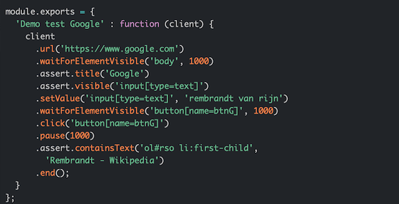

# 端到端测试(End-to-End Testing)

`e2e 测试`是一种黑盒测试类型，类似于系统测试。**e2e 测试在模拟的、完整的、真实应用环境下模拟真实用户对应用进行测试，比如应用会和数据库交互，会使用网络通信、或者在适当的情况下和其他硬件、应用、系统进行交互**。`端到端是指从一个端点到另一个端点的意思，所以端到端测试重点用于测试模块和模块之间的协调性`。

当应用是分布式系统或者需要和其他外部系统协同时，e2e 测试扮演者非常重要的角色，它可以全面检查以确保软件在不同平台和环境产品能准确地交互。e2e 测试有以下目的：

- `确保应用可以和外部系统之间良好的协调`。对前端来说，是确保页面和后端之间良好协调
- `检查从源系统到目标系统的所有系统流`
- `从最终用户角度验证需求`
- `识别异构环境中的问题`

前端有很多自动化的 e2e 测试工具，比如 nightwatch，通过它们可以模拟用户对页面进行操作，从而检验整个应用流程是否正常和符合需求。

