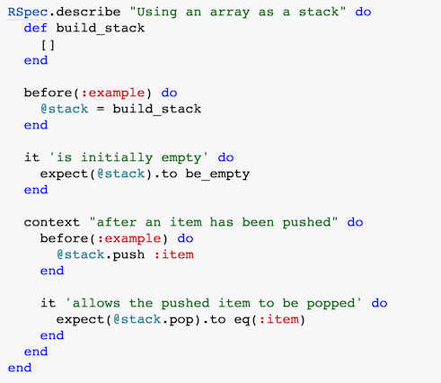

# 单元测试

`测试独立的软件单元或模块称为单元测试`。单元测试是和我们开发者最密切相关的测试类型。它的测试对象是软件单元。`软件单元可以是一个函数/方法、一个类或者一个GUI组件等`。

这是一种白盒测试，所以要求由开发者自己进行，因为只有开发者才知道单元的内部实现。`单元测试一般会使用测试覆盖率来验证单元测试的完成度`。

常见的单元测试工具由 Jest、Mocha等。

典型的 BDD 风格单元测试组织：

## 基于 Karma+Mocha+Chai+SinonJS 的单元测试

### Karma

`Karma` 是一个测试运行器

### Mocha

`mocha` 是一个流行的 JavaScript 测试框架库，使用它能方便地创建测试套件、测试用例和测试规范。Mocha可以用来在前端或者后端测试TypeScript，指出性能问题，生成不同类型的测试报告，还有很多其他功能。

### Chai

`Chai`是一个支持测试驱动开发(TDD)和行为驱动开发(BDD)测试风格的断言库。Chai的主要目标是减少创建一个测试断言需要的工作量，并且使测试更可读。

### Sinon.JS

`Sinon.JS`是一个独立的框架，它提供了一组API(测试监视、测试桩和测试模拟)，可帮助我们独立地测试一个组件。