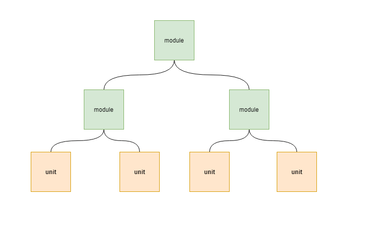

# 集成测试

`集成测试`是指将所有模块集成之后，验证合并后的功能。模块通常是代码模块、单个应用、网络上的客户端和服务器应用等等。

`集成测试`一般在单元测试之后，所以单元测试是集成测试的基础，没有进行单元测试的集成测试是不靠谱的。所以最简单的形式是：“把两个已经测试过的单元组合成一个组件，测试它们之间的接口”。`也就是说集成测试在单元测试的基础之上，将单元测试中独立的单元合并起来，验证它们的协调性，合并后的组件又是一个新的单元，这样逐步合并测试，最终形成完整的应用程序`。

这种类型的测试常用于 B/S 软件和分布式系统。